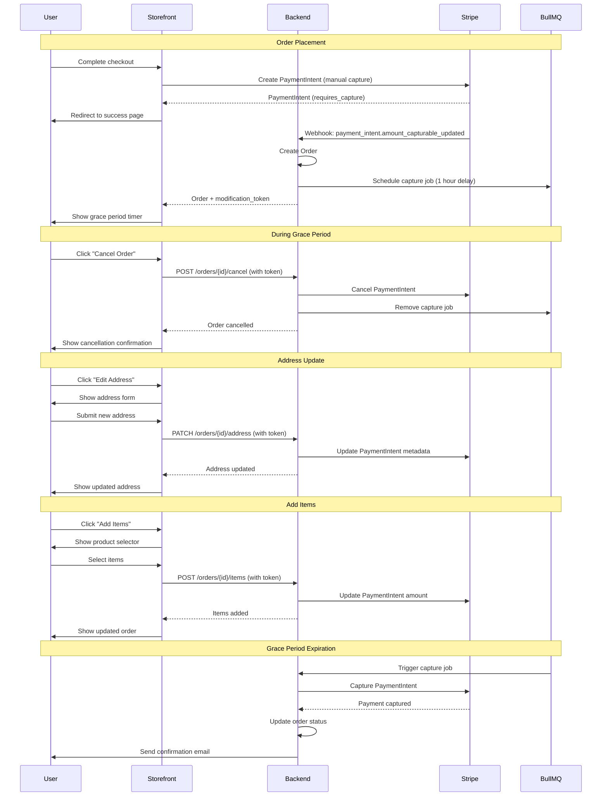
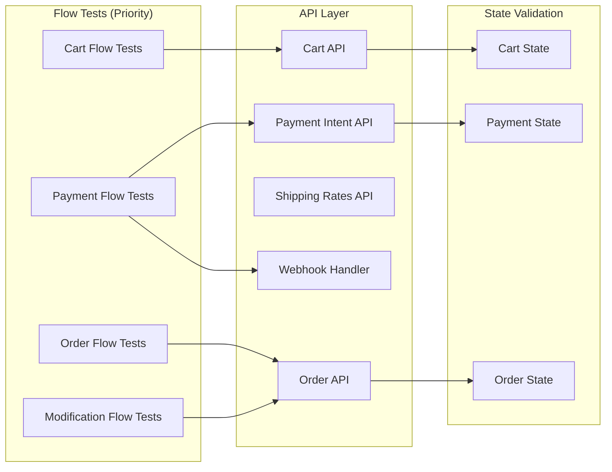

# Design Document: E2E Testing Overhaul

## Overview

This design document outlines the architecture and implementation approach for overhauling the Grace Stowel E2E testing suite. The overhaul transforms the current fragmented test suite into a robust, maintainable, and comprehensive testing framework using Playwright with a TDD approach.

The key design principles are:
1. **Page Object Model (POM)** for maintainable, reusable page interactions
2. **Semantic assertions** over screenshot comparisons for reliability
3. **Webhook mocking** for Stripe payment testing without UI automation of hosted pages
4. **Network-first pattern** for deterministic test execution
5. **API-based setup** for fast, reliable test data preparation

## Architecture

```mermaid
graph TB
    subgraph "Test Layer"
        CT[Checkout Tests]
        OT[Order Tests]
        PT[Payment Tests]
        RT[Resilience Tests]
    end
    
    subgraph "Page Objects"
        HP[HomePage]
        PP[ProductPage]
        CP[CartPage]
        COP[CheckoutPage]
        OSP[OrderStatusPage]
    end
    
    subgraph "Fixtures"
        AF[API Fixture]
        DF[Data Factory Fixture]
        SF[Stripe Mock Fixture]
        WF[Webhook Mock Fixture]
    end
    
    subgraph "Helpers"
        AH[API Request Helper]
        NH[Network Helper]
        SH[Seed Helper]
        PH[Price Helper]
    end
    
    subgraph "External Services"
        BE[Backend API]
        ST[Stripe API]
        ME[Medusa API]
    end
    
    CT --> COP
    CT --> CP
    OT --> OSP
    PT --> SF
    PT --> WF
    
    HP --> AF
    PP --> AF
    CP --> AF
    COP --> AF
    OSP --> AF
    
    AF --> AH
    DF --> SH
    SF --> NH
    WF --> NH
    
    AH --> BE
    AH --> ME
    SF --> ST


## Components and Interfaces

### Page Object Model Classes

#### HomePage
```typescript
class HomePage {
  readonly page: Page;
  readonly productGrid: Locator;
  readonly searchBar: Locator;
  readonly cartButton: Locator;
  
  async goto(): Promise<void>;
  async getProducts(): Promise<ProductCard[]>;
  async searchProducts(query: string): Promise<void>;
  async openCart(): Promise<void>;
}
```

#### ProductPage
```typescript
class ProductPage {
  readonly page: Page;
  readonly title: Locator;
  readonly price: Locator;
  readonly addToCartButton: Locator;
  readonly colorSelector: Locator;
  readonly quantityInput: Locator;
  
  async goto(handle: string): Promise<void>;
  async addToCart(options?: { color?: string; quantity?: number }): Promise<void>;
  async getProductDetails(): Promise<ProductDetails>;
}
```

#### CartPage
```typescript
class CartPage {
  readonly page: Page;
  readonly cartDrawer: Locator;
  readonly cartItems: Locator;
  readonly cartTotal: Locator;
  readonly checkoutButton: Locator;
  
  async open(): Promise<void>;
  async close(): Promise<void>;
  async getItems(): Promise<CartItem[]>;
  async updateQuantity(productId: string, quantity: number): Promise<void>;
  async removeItem(productId: string): Promise<void>;
  async proceedToCheckout(): Promise<void>;
}
```

#### CheckoutPage
```typescript
class CheckoutPage {
  readonly page: Page;
  readonly emailInput: Locator;
  readonly shippingForm: Locator;
  readonly shippingOptions: Locator;
  readonly paymentElement: Locator;
  readonly submitButton: Locator;
  readonly orderSummary: Locator;
  
  async goto(): Promise<void>;
  async fillShippingAddress(address: ShippingAddress): Promise<void>;
  async selectShippingOption(optionId: string): Promise<void>;
  async fillPaymentDetails(card: TestCard): Promise<void>;
  async submitPayment(): Promise<void>;
  async getOrderSummary(): Promise<OrderSummary>;
  async waitForPaymentIntent(): Promise<string>;
}
```

#### OrderStatusPage
```typescript
class OrderStatusPage {
  readonly page: Page;
  readonly orderNumber: Locator;
  readonly graceTimer: Locator;
  readonly cancelButton: Locator;
  readonly editAddressButton: Locator;
  readonly addItemsButton: Locator;
  
  async goto(orderId: string, token?: string): Promise<void>;
  async getOrderDetails(): Promise<OrderDetails>;
  async isWithinGracePeriod(): Promise<boolean>;
  async cancelOrder(): Promise<void>;
  async editAddress(newAddress: ShippingAddress): Promise<void>;
  async getRemainingTime(): Promise<number>;
}
```

### Fixtures

#### Stripe Mock Fixture
```typescript
interface StripeMockFixture {
  mockPaymentIntent(status: 'succeeded' | 'requires_capture' | 'requires_action' | 'canceled'): Promise<void>;
  mockDeclinedPayment(declineCode: string): Promise<void>;
  mock3DSChallenge(outcome: 'authenticated' | 'failed'): Promise<void>;
  getLastPaymentIntentId(): string | null;
}
```

#### Webhook Mock Fixture
```typescript
interface WebhookMockFixture {
  mockWebhookEvent(eventType: string, payload: object): Promise<void>;
  mockPaymentIntentAuthorized(paymentIntentId: string, amount: number): Promise<void>;
  mockPaymentIntentCaptured(paymentIntentId: string): Promise<void>;
  mockPaymentIntentFailed(paymentIntentId: string, error: string): Promise<void>;
}
```

#### Data Factory Fixture
```typescript
interface DataFactoryFixture {
  createProduct(overrides?: Partial<Product>): Promise<Product>;
  createCustomer(overrides?: Partial<Customer>): Promise<Customer>;
  createOrder(overrides?: Partial<Order>): Promise<Order>;
  cleanup(): Promise<void>;
}
```

### Helpers

#### Test Cards
```typescript
const TEST_CARDS = {
  SUCCESS: '4242424242424242',
  DECLINE_GENERIC: '4000000000000002',
  DECLINE_INSUFFICIENT_FUNDS: '4000000000009995',
  DECLINE_LOST_CARD: '4000000000009987',
  REQUIRES_3DS: '4000002760003184',
  REQUIRES_3DS_FAIL: '4000008260003178',
} as const;
```

#### Price Helper
```typescript
function toCents(amount: number): number;
function fromCents(cents: number): number;
function formatPrice(amount: number, currency?: string): string;
function calculateTotal(items: CartItem[]): number;
```

## Data Models

### CartItem
```typescript
interface CartItem {
  id: string | number;
  variantId?: string;
  sku?: string;
  title: string;
  price: string;
  originalPrice?: string;
  quantity: number;
  color?: string;
  image?: string;
}
```

### ShippingAddress
```typescript
interface ShippingAddress {
  firstName: string;
  lastName: string;
  address1: string;
  address2?: string;
  city: string;
  state?: string;
  postalCode: string;
  countryCode: string;
  phone?: string;
}
```

### OrderDetails
```typescript
interface OrderDetails {
  id: string;
  displayId: number;
  status: string;
  total: number;
  currencyCode: string;
  items: OrderItem[];
  shippingAddress?: ShippingAddress;
  createdAt: Date;
  modificationAllowed: boolean;
  remainingSeconds: number;
}
```

### WebhookPayload
```typescript
interface WebhookPayload {
  id: string;
  type: string;
  data: {
    object: PaymentIntent | Charge | CheckoutSession;
  };
  created: number;
  livemode: boolean;
}
```


## Correctness Properties

*A property is a characteristic or behavior that should hold true across all valid executions of a system-essentially, a formal statement about what the system should do. Properties serve as the bridge between human-readable specifications and machine-verifiable correctness guarantees.*

Based on the prework analysis, the following correctness properties have been identified. Properties that are redundant or can be combined have been consolidated.

### Property 1: Cart State Consistency
*For any* sequence of cart operations (add, update, remove), the cart total SHALL equal the sum of (item.price × item.quantity) for all items in the cart.
**Validates: Requirements 12.1, 15.1**

### Property 2: PaymentIntent Amount Consistency
*For any* PaymentIntent created or updated, the amount in cents SHALL equal (cartTotal + shippingCost) × 100, rounded to the nearest integer.
**Validates: Requirements 12.4, 12.5, 15.5**

### Property 3: Stock Validation Error Display
*For any* cart item where requested quantity exceeds available inventory, the checkout SHALL display an error message listing the item name and available quantity.
**Validates: Requirements 12.8**

### Property 4: Payment Authorization State
*For any* successful payment submission with manual capture mode, the PaymentIntent status SHALL transition to 'requires_capture'.
**Validates: Requirements 12.9**

### Property 5: Order Creation from Webhook
*For any* PaymentIntent with status 'requires_capture', when the payment_intent.amount_capturable_updated webhook is received, an order SHALL be created with the correct items and amounts.
**Validates: Requirements 13.1**

### Property 6: Modification Token Generation
*For any* newly created order, a modification token SHALL be generated and returned with the order response, valid for the grace period duration.
**Validates: Requirements 13.2**

### Property 7: Grace Period Modification Availability
*For any* order where (currentTime - createdAt) < gracePeriodDuration, the modification options (cancel, edit address, add items) SHALL be visible and functional.
**Validates: Requirements 8.2, 13.3**

### Property 8: Grace Period Expiration Behavior
*For any* order where (currentTime - createdAt) >= gracePeriodDuration, the modification options SHALL be hidden and the payment capture job SHALL be triggered.
**Validates: Requirements 8.3, 13.4**

### Property 9: Order Cancellation During Grace Period
*For any* order cancelled within the grace period, the PaymentIntent SHALL be cancelled, the BullMQ capture job SHALL be removed, and the order status SHALL update to 'cancelled'.
**Validates: Requirements 8.5, 13.6**

### Property 10: Payment Decline Error Display
*For any* payment attempt with a decline test card, the checkout SHALL display an appropriate error message matching the decline reason.
**Validates: Requirements 9.2, 14.1**

### Property 11: 3D Secure Challenge Handling
*For any* payment attempt with a 3DS-required test card, the 3D Secure authentication modal SHALL appear and the payment outcome SHALL match the authentication result.
**Validates: Requirements 9.3, 14.2**

### Property 12: Idempotency Key Duplicate Prevention
*For any* PaymentIntent creation request with the same idempotency key, Stripe SHALL return the same PaymentIntent without creating a duplicate.
**Validates: Requirements 14.3**

### Property 13: Fallback Capture Recovery
*For any* order with a PaymentIntent in 'requires_capture' status that has been uncaptured for more than 65 minutes, the fallback capture job SHALL capture the payment.
**Validates: Requirements 14.4**

### Property 14: Cart Persistence Across Sessions
*For any* cart state, after page reload or browser restart, the cart items SHALL be restored from localStorage with the same items and quantities.
**Validates: Requirements 2.2, 4.3**

### Property 15: Responsive Viewport Behavior
*For any* critical user flow (browse, add to cart, checkout), the flow SHALL complete successfully on both desktop (1280×720) and mobile (375×667) viewports.
**Validates: Requirements 2.5, 7.5**

## Error Handling

### Payment Errors
- **Declined payments**: Display user-friendly error message with decline reason, allow retry with different card
- **3DS failures**: Display authentication failed message, allow retry
- **Network timeouts**: Show loading state, retry with exponential backoff, display error after max retries
- **Validation errors**: Display field-specific error messages from API response

### Order Errors
- **Stock validation failures**: Display out-of-stock items with available quantities, prevent checkout
- **Shipping rate fetch failures**: Display error message, allow retry, fall back to default rates
- **Order creation failures**: Log error, display generic error message, preserve cart state

### Webhook Errors
- **Webhook delivery failures**: Rely on Stripe retry mechanism (up to 3 days)
- **Webhook processing failures**: Log error, mark order for manual review
- **Redis unavailability**: Flag order with needs_recovery metadata for fallback processing

## Testing Strategy

### Property-Based Testing Library
The test suite will use **fast-check** for property-based testing in TypeScript. Fast-check provides:
- Arbitrary generators for complex data types
- Shrinking for minimal failing examples
- Reproducible test runs with seed values

### Unit Tests
Unit tests will cover:
- Price calculation utilities (toCents, fromCents, calculateTotal)
- Cart state management (add, remove, update operations)
- Idempotency key generation
- Modification token validation

### Property-Based Tests
Property-based tests will verify:
- Cart total calculation consistency (Property 1)
- Free gift threshold invariant (Property 2)
- PaymentIntent amount consistency (Property 3)
- Shipping rate calculations (Property 4)

### E2E Tests
E2E tests will verify:
- Complete checkout flow (Properties 5, 6)
- Order lifecycle (Properties 7-11)
- Payment failure scenarios (Properties 12-15)
- Cross-browser and responsive behavior (Properties 16, 17)

### Test Annotation Format
Each property-based test MUST include a comment referencing the correctness property:
```typescript
// **Feature: e2e-testing-overhaul, Property 1: Cart State Consistency**
test.prop([fc.array(cartItemArbitrary)])('cart total equals sum of item prices', (items) => {
  // test implementation
});
```

### Webhook Mocking Strategy
Instead of automating Stripe's hosted checkout pages, tests will:
1. Intercept the PaymentIntent creation API call
2. Mock the payment confirmation response
3. Simulate webhook delivery by calling the webhook endpoint directly with test payloads
4. Verify order creation and state transitions

This approach is recommended by Stripe for E2E testing and avoids the brittleness of UI automation on third-party pages.

### Test Data Strategy
- **Dynamic product discovery**: Fetch available products via Medusa API at test start
- **Unique identifiers**: Use timestamps and UUIDs for test data to prevent collisions
- **Cleanup**: Delete created test data after each test using API calls
- **Environment configuration**: Read API URLs and keys from environment variables


## Detailed Page Object Implementations

### HomePage Implementation

```typescript
import { Page, Locator, expect } from '@playwright/test';

export interface ProductCardData {
  id: string;
  handle: string;
  title: string;
  price: string;
  image: string;
}

export class HomePage {
  readonly page: Page;
  
  // Locators
  readonly productGrid: Locator;
  readonly searchBar: Locator;
  readonly cartButton: Locator;
  readonly announcementBar: Locator;
  readonly bestSellersHeading: Locator;
  readonly productCards: Locator;
  readonly loadingSpinner: Locator;
  
  constructor(page: Page) {
    this.page = page;
    this.productGrid = page.locator('[data-testid="product-grid"]');
    this.searchBar = page.getByRole('searchbox', { name: /search/i });
    this.cartButton = page.getByRole('button', { name: /cart/i });
    this.announcementBar = page.locator('[data-testid="announcement-bar"]');
    this.bestSellersHeading = page.getByRole('heading', { name: /best sellers/i });
    this.productCards = page.locator('a[href^="/products/"]');
    this.loadingSpinner = page.locator('[data-testid="loading-spinner"]');
  }
  
  async goto(): Promise<void> {
    // Network-first: Wait for products API before asserting
    const productsPromise = this.page.waitForResponse(
      (response) => response.url().includes('/store/products') && response.status() === 200
    );
    
    await this.page.goto('/');
    await productsPromise;
    await expect(this.bestSellersHeading).toBeVisible();
  }
  
  async getProducts(): Promise<ProductCardData[]> {
    await expect(this.productCards.first()).toBeVisible();
    
    const cards = await this.productCards.all();
    const products: ProductCardData[] = [];
    
    for (const card of cards) {
      const href = await card.getAttribute('href');
      const handle = href?.replace('/products/', '') || '';
      const title = await card.locator('[data-testid="product-title"]').textContent() || '';
      const price = await card.locator('[data-testid="product-price"]').textContent() || '';
      const image = await card.locator('img').getAttribute('src') || '';
      
      products.push({ id: handle, handle, title, price, image });
    }
    
    return products;
  }
  
  async searchProducts(query: string): Promise<void> {
    await this.searchBar.fill(query);
    await this.searchBar.press('Enter');
    await this.page.waitForURL(/\/search\?q=/);
  }
  
  async openCart(): Promise<void> {
    await this.cartButton.click();
    await expect(this.page.getByRole('heading', { name: /towel rack/i })).toBeVisible();
  }
  
  async getFirstProductHandle(): Promise<string> {
    const firstCard = this.productCards.first();
    await expect(firstCard).toBeVisible();
    const href = await firstCard.getAttribute('href');
    return href?.replace('/products/', '') || '';
  }
}
```

### ProductPage Implementation

```typescript
import { Page, Locator, expect } from '@playwright/test';

export interface ProductDetails {
  title: string;
  price: string;
  originalPrice?: string;
  description: string;
  colors: string[];
  inStock: boolean;
}

export class ProductPage {
  readonly page: Page;
  
  // Locators
  readonly title: Locator;
  readonly price: Locator;
  readonly originalPrice: Locator;
  readonly description: Locator;
  readonly addToCartButton: Locator;
  readonly colorSelector: Locator;
  readonly quantityInput: Locator;
  readonly quantityIncrease: Locator;
  readonly quantityDecrease: Locator;
  readonly outOfStockMessage: Locator;
  readonly imageGallery: Locator;
  
  constructor(page: Page) {
    this.page = page;
    this.title = page.getByRole('heading', { level: 1 });
    this.price = page.locator('[data-testid="product-price"]');
    this.originalPrice = page.locator('[data-testid="original-price"]');
    this.description = page.locator('[data-testid="product-description"]');
    this.addToCartButton = page.getByRole('button', { name: /hang it up|add to cart/i });
    this.colorSelector = page.locator('[data-testid="color-selector"]');
    this.quantityInput = page.getByLabel(/quantity/i);
    this.quantityIncrease = page.getByRole('button', { name: /increase quantity/i });
    this.quantityDecrease = page.getByRole('button', { name: /decrease quantity/i });
    this.outOfStockMessage = page.getByText(/out of stock/i);
    this.imageGallery = page.locator('[data-testid="image-gallery"]');
  }
  
  async goto(handle: string): Promise<void> {
    // Network-first: Wait for product API
    const productPromise = this.page.waitForResponse(
      (response) => response.url().includes(`/store/products/${handle}`) && response.status() === 200
    );
    
    await this.page.goto(`/products/${handle}`);
    await productPromise;
    await expect(this.title).toBeVisible();
  }
  
  async addToCart(options?: { color?: string; quantity?: number }): Promise<void> {
    // Select color if specified
    if (options?.color) {
      await this.selectColor(options.color);
    }
    
    // Set quantity if specified
    if (options?.quantity && options.quantity > 1) {
      for (let i = 1; i < options.quantity; i++) {
        await this.quantityIncrease.click();
      }
    }
    
    // Network-first: Wait for cart API
    const cartPromise = this.page.waitForResponse(
      (response) => (response.url().includes('/store/carts') || response.url().includes('/store/cart')) && response.status() === 200
    );
    
    await this.addToCartButton.click();
    await cartPromise;
    
    // Verify cart drawer opens
    await expect(this.page.getByRole('heading', { name: /towel rack/i })).toBeVisible();
  }
  
  async selectColor(color: string): Promise<void> {
    const colorButton = this.colorSelector.getByRole('button', { name: new RegExp(color, 'i') });
    await colorButton.click();
    await expect(colorButton).toHaveAttribute('aria-pressed', 'true');
  }
  
  async getProductDetails(): Promise<ProductDetails> {
    const title = await this.title.textContent() || '';
    const price = await this.price.textContent() || '';
    const originalPrice = await this.originalPrice.textContent().catch(() => undefined);
    const description = await this.description.textContent() || '';
    
    const colorButtons = await this.colorSelector.getByRole('button').all();
    const colors = await Promise.all(colorButtons.map(btn => btn.textContent().then(t => t || '')));
    
    const inStock = !(await this.outOfStockMessage.isVisible().catch(() => false));
    
    return { title, price, originalPrice, description, colors, inStock };
  }
  
  async isInStock(): Promise<boolean> {
    return !(await this.outOfStockMessage.isVisible().catch(() => false));
  }
}
```

### CheckoutPage Implementation

```typescript
import { Page, Locator, expect, FrameLocator } from '@playwright/test';

export interface ShippingOption {
  id: string;
  displayName: string;
  amount: number;
  originalAmount?: number;
  isFree: boolean;
}

export interface OrderSummary {
  items: Array<{ title: string; quantity: number; price: string }>;
  subtotal: number;
  shipping: number;
  total: number;
}

export class CheckoutPage {
  readonly page: Page;
  
  // Locators
  readonly emailInput: Locator;
  readonly shippingForm: Locator;
  readonly shippingOptions: Locator;
  readonly paymentElement: FrameLocator;
  readonly submitButton: Locator;
  readonly orderSummary: Locator;
  readonly errorMessage: Locator;
  readonly loadingOverlay: Locator;
  readonly backToShopLink: Locator;
  
  // Stripe Elements frame locators
  readonly cardNumberInput: Locator;
  readonly cardExpiryInput: Locator;
  readonly cardCvcInput: Locator;
  
  constructor(page: Page) {
    this.page = page;
    this.emailInput = page.getByLabel(/email/i);
    this.shippingForm = page.locator('[data-testid="shipping-form"]');
    this.shippingOptions = page.locator('[data-testid="shipping-options"]');
    this.paymentElement = page.frameLocator('iframe[name^="__privateStripeFrame"]');
    this.submitButton = page.getByRole('button', { name: /pay|place order|complete/i });
    this.orderSummary = page.locator('[data-testid="order-summary"]');
    this.errorMessage = page.locator('[data-testid="payment-error"]');
    this.loadingOverlay = page.locator('[data-testid="loading-overlay"]');
    this.backToShopLink = page.getByRole('link', { name: /return to/i });
    
    // Stripe card inputs (within iframe)
    this.cardNumberInput = this.paymentElement.locator('[name="cardnumber"]');
    this.cardExpiryInput = this.paymentElement.locator('[name="exp-date"]');
    this.cardCvcInput = this.paymentElement.locator('[name="cvc"]');
  }
  
  async goto(): Promise<void> {
    await this.page.goto('/checkout');
    await expect(this.page).toHaveURL(/\/checkout/);
  }
  
  async fillShippingAddress(address: {
    firstName: string;
    lastName: string;
    address1: string;
    address2?: string;
    city: string;
    state?: string;
    postalCode: string;
    country: string;
    phone?: string;
  }): Promise<void> {
    // Wait for Stripe Address Element to load
    const addressFrame = this.page.frameLocator('iframe[name^="__privateStripeFrame"]').first();
    
    await addressFrame.getByLabel(/first name/i).fill(address.firstName);
    await addressFrame.getByLabel(/last name/i).fill(address.lastName);
    await addressFrame.getByLabel(/address/i).first().fill(address.address1);
    if (address.address2) {
      await addressFrame.getByLabel(/apartment|suite|unit/i).fill(address.address2);
    }
    await addressFrame.getByLabel(/city/i).fill(address.city);
    if (address.state) {
      await addressFrame.getByLabel(/state|province/i).fill(address.state);
    }
    await addressFrame.getByLabel(/postal|zip/i).fill(address.postalCode);
    await addressFrame.getByLabel(/country/i).selectOption(address.country);
    if (address.phone) {
      await addressFrame.getByLabel(/phone/i).fill(address.phone);
    }
    
    // Wait for shipping rates to load
    await this.page.waitForResponse(
      (response) => response.url().includes('/api/shipping-rates') && response.status() === 200
    );
  }
  
  async selectShippingOption(optionId: string): Promise<void> {
    const option = this.shippingOptions.locator(`[data-shipping-id="${optionId}"]`);
    await option.click();
    await expect(option).toHaveAttribute('aria-checked', 'true');
  }
  
  async fillPaymentDetails(card: {
    number: string;
    expiry: string;
    cvc: string;
  }): Promise<void> {
    // Wait for Payment Element to load
    await expect(this.cardNumberInput).toBeVisible({ timeout: 10000 });
    
    await this.cardNumberInput.fill(card.number);
    await this.cardExpiryInput.fill(card.expiry);
    await this.cardCvcInput.fill(card.cvc);
  }
  
  async submitPayment(): Promise<void> {
    await this.submitButton.click();
    
    // Wait for either success redirect or error
    await Promise.race([
      this.page.waitForURL(/\/checkout\/success/),
      expect(this.errorMessage).toBeVisible(),
    ]);
  }
  
  async getOrderSummary(): Promise<OrderSummary> {
    const items: Array<{ title: string; quantity: number; price: string }> = [];
    
    const itemElements = await this.orderSummary.locator('[data-testid="order-item"]').all();
    for (const item of itemElements) {
      const title = await item.locator('[data-testid="item-title"]').textContent() || '';
      const quantityText = await item.locator('[data-testid="item-quantity"]').textContent() || '1';
      const price = await item.locator('[data-testid="item-price"]').textContent() || '';
      items.push({ title, quantity: parseInt(quantityText), price });
    }
    
    const subtotalText = await this.orderSummary.locator('[data-testid="subtotal"]').textContent() || '0';
    const shippingText = await this.orderSummary.locator('[data-testid="shipping-cost"]').textContent() || '0';
    const totalText = await this.orderSummary.locator('[data-testid="total"]').textContent() || '0';
    
    return {
      items,
      subtotal: parseFloat(subtotalText.replace(/[^0-9.]/g, '')),
      shipping: parseFloat(shippingText.replace(/[^0-9.]/g, '')),
      total: parseFloat(totalText.replace(/[^0-9.]/g, '')),
    };
  }
  
  async waitForPaymentIntent(): Promise<string> {
    const response = await this.page.waitForResponse(
      (response) => response.url().includes('/api/payment-intent') && response.status() === 200
    );
    const data = await response.json() as { paymentIntentId: string };
    return data.paymentIntentId;
  }
  
  async getErrorMessage(): Promise<string | null> {
    if (await this.errorMessage.isVisible()) {
      return await this.errorMessage.textContent();
    }
    return null;
  }
}
```

### OrderStatusPage Implementation

```typescript
import { Page, Locator, expect } from '@playwright/test';

export interface OrderModificationOptions {
  canCancel: boolean;
  canEditAddress: boolean;
  canAddItems: boolean;
}

export class OrderStatusPage {
  readonly page: Page;
  
  // Locators
  readonly orderNumber: Locator;
  readonly orderStatus: Locator;
  readonly graceTimer: Locator;
  readonly cancelButton: Locator;
  readonly editAddressButton: Locator;
  readonly addItemsButton: Locator;
  readonly confirmCancelButton: Locator;
  readonly cancelDialog: Locator;
  readonly editAddressDialog: Locator;
  readonly addItemsDialog: Locator;
  readonly processingMessage: Locator;
  readonly linkExpiredHeading: Locator;
  readonly requestNewLinkButton: Locator;
  readonly orderItems: Locator;
  readonly shippingAddress: Locator;
  readonly orderTotal: Locator;
  
  constructor(page: Page) {
    this.page = page;
    this.orderNumber = page.locator('[data-testid="order-number"]');
    this.orderStatus = page.locator('[data-testid="order-status"]');
    this.graceTimer = page.getByRole('timer');
    this.cancelButton = page.getByRole('button', { name: /cancel order/i });
    this.editAddressButton = page.getByRole('button', { name: /edit address/i });
    this.addItemsButton = page.getByRole('button', { name: /add items/i });
    this.confirmCancelButton = page.getByRole('button', { name: /confirm.*cancel/i });
    this.cancelDialog = page.getByRole('dialog', { name: /cancel/i });
    this.editAddressDialog = page.getByRole('dialog', { name: /edit.*address/i });
    this.addItemsDialog = page.getByRole('dialog', { name: /add.*items/i });
    this.processingMessage = page.getByText(/being processed/i);
    this.linkExpiredHeading = page.getByRole('heading', { name: /link expired/i });
    this.requestNewLinkButton = page.getByRole('button', { name: /request new link/i });
    this.orderItems = page.locator('[data-testid="order-items"]');
    this.shippingAddress = page.locator('[data-testid="shipping-address"]');
    this.orderTotal = page.locator('[data-testid="order-total"]');
  }
  
  async goto(orderId: string, token?: string): Promise<void> {
    const url = token 
      ? `/order/status/${orderId}?token=${token}`
      : `/order/status/${orderId}`;
    
    // Network-first: Wait for order status API
    const orderStatusPromise = this.page.waitForResponse(
      (response) => response.url().includes(`/order/status/${orderId}`) && [200, 401, 403, 404].includes(response.status())
    );
    
    await this.page.goto(url);
    await orderStatusPromise;
  }
  
  async isWithinGracePeriod(): Promise<boolean> {
    return await this.graceTimer.isVisible().catch(() => false);
  }
  
  async getModificationOptions(): Promise<OrderModificationOptions> {
    return {
      canCancel: await this.cancelButton.isVisible().catch(() => false),
      canEditAddress: await this.editAddressButton.isVisible().catch(() => false),
      canAddItems: await this.addItemsButton.isVisible().catch(() => false),
    };
  }
  
  async cancelOrder(): Promise<void> {
    await this.cancelButton.click();
    await expect(this.cancelDialog).toBeVisible();
    
    // Network-first: Wait for cancel API
    const cancelPromise = this.page.waitForResponse(
      (response) => response.url().includes('/orders') && response.request().method() === 'POST' && [200, 204].includes(response.status())
    );
    
    await this.confirmCancelButton.click();
    await cancelPromise;
    
    // Verify cancellation
    await expect(this.page.getByText(/cancel(l)?ed/i)).toBeVisible();
  }
  
  async editAddress(newAddress: {
    address1: string;
    city: string;
    postalCode: string;
  }): Promise<void> {
    await this.editAddressButton.click();
    await expect(this.editAddressDialog).toBeVisible();
    
    await this.editAddressDialog.getByLabel(/address/i).fill(newAddress.address1);
    await this.editAddressDialog.getByLabel(/city/i).fill(newAddress.city);
    await this.editAddressDialog.getByLabel(/postal|zip/i).fill(newAddress.postalCode);
    
    // Network-first: Wait for update API
    const updatePromise = this.page.waitForResponse(
      (response) => response.url().includes('/orders') && response.request().method() === 'PATCH' && response.status() === 200
    );
    
    await this.editAddressDialog.getByRole('button', { name: /save|update/i }).click();
    await updatePromise;
    
    await expect(this.editAddressDialog).toBeHidden();
  }
  
  async getRemainingTime(): Promise<number> {
    if (!(await this.isWithinGracePeriod())) {
      return 0;
    }
    
    const timerText = await this.graceTimer.textContent() || '00:00';
    const [minutes, seconds] = timerText.split(':').map(Number);
    return (minutes * 60) + seconds;
  }
  
  async waitForGracePeriodExpiration(): Promise<void> {
    await this.page.waitForFunction(
      () => {
        const timerElement = document.querySelector('[role="timer"]');
        return !timerElement || timerElement.getAttribute('aria-hidden') === 'true';
      },
      { timeout: 70000 } // Grace period + buffer
    );
    
    await expect(this.processingMessage).toBeVisible();
  }
  
  async isLinkExpired(): Promise<boolean> {
    return await this.linkExpiredHeading.isVisible().catch(() => false);
  }
  
  async requestNewLink(): Promise<void> {
    await expect(this.requestNewLinkButton).toBeVisible();
    await this.requestNewLinkButton.click();
    // Handle new link request flow
  }
}
```

## Order Modification User Flow

### Flow Diagram



### Modification Token Validation

```typescript
// Token structure
interface ModificationToken {
  order_id: string;
  payment_intent_id: string;
  exp: number; // Unix timestamp
  iat: number; // Issued at
}

// Validation flow
async function validateModificationToken(token: string, orderId: string): Promise<{
  valid: boolean;
  error?: 'TOKEN_EXPIRED' | 'TOKEN_INVALID' | 'ORDER_NOT_FOUND' | 'GRACE_PERIOD_EXPIRED';
}> {
  try {
    const decoded = jwt.verify(token, JWT_SECRET) as ModificationToken;
    
    if (decoded.order_id !== orderId) {
      return { valid: false, error: 'TOKEN_INVALID' };
    }
    
    const order = await getOrder(orderId);
    if (!order) {
      return { valid: false, error: 'ORDER_NOT_FOUND' };
    }
    
    if (!isWithinGracePeriod(order.created_at)) {
      return { valid: false, error: 'GRACE_PERIOD_EXPIRED' };
    }
    
    return { valid: true };
  } catch (error) {
    if (error.name === 'TokenExpiredError') {
      return { valid: false, error: 'TOKEN_EXPIRED' };
    }
    return { valid: false, error: 'TOKEN_INVALID' };
  }
}
```

## Error Handling Edge Cases

### Payment Error Scenarios

| Scenario | Stripe Test Card | Expected Behavior | UI Response |
|----------|------------------|-------------------|-------------|
| Generic decline | 4000000000000002 | Payment fails immediately | "Your card was declined. Please try a different card." |
| Insufficient funds | 4000000000009995 | Payment fails immediately | "Your card has insufficient funds." |
| Lost card | 4000000000009987 | Payment fails immediately | "Your card was reported lost. Please use a different card." |
| Expired card | 4000000000000069 | Payment fails immediately | "Your card has expired. Please use a different card." |
| Processing error | 4000000000000119 | Payment fails immediately | "An error occurred processing your card. Please try again." |
| 3DS required - success | 4000002760003184 | 3DS modal appears, user authenticates | Payment proceeds after authentication |
| 3DS required - fail | 4000008260003178 | 3DS modal appears, authentication fails | "Authentication failed. Please try again or use a different card." |

### Network Error Scenarios

| Scenario | Trigger | Expected Behavior | Recovery |
|----------|---------|-------------------|----------|
| PaymentIntent creation timeout | Network delay > 30s | Show timeout error | Retry with same idempotency key |
| PaymentIntent update failure | Network error during update | Preserve existing PaymentIntent | Retry update on next cart change |
| Shipping rates fetch failure | API returns 500 | Show error, allow retry | Display "Retry" button, fall back to default rates |
| Webhook delivery failure | Stripe can't reach endpoint | Stripe retries (up to 3 days) | Fallback capture job after 65 minutes |
| Redis unavailable | Connection refused | Flag order with needs_recovery | Fallback cron job processes flagged orders |

### Order Modification Error Scenarios

| Scenario | Trigger | Expected Behavior | UI Response |
|----------|---------|-------------------|-------------|
| Token expired | JWT exp < now | Reject modification | "Your modification link has expired. Request a new link." |
| Token invalid signature | Wrong JWT secret | Reject modification | "Invalid authorization. Please use the link from your email." |
| Grace period expired | Order created > 1 hour ago | Reject modification | "The modification window has closed. Your order is being processed." |
| Order already cancelled | Order status = cancelled | Reject modification | "This order has already been cancelled." |
| Order already captured | PaymentIntent status = succeeded | Reject modification | "This order has already been processed and cannot be modified." |
| Concurrent modification | Race condition | Use optimistic locking | "This order was modified. Please refresh and try again." |

### Stock Validation Error Scenarios

| Scenario | Trigger | Expected Behavior | UI Response |
|----------|---------|-------------------|-------------|
| Item out of stock | inventory_quantity = 0 | Block checkout | "The Nuzzle is out of stock. Please remove it from your cart." |
| Insufficient quantity | requested > available | Block checkout | "Only 3 of The Nuzzle are available. Please reduce quantity." |
| Multiple items affected | Multiple items low stock | Block checkout | List all affected items with available quantities |
| Stock changed during checkout | Inventory updated after cart | Re-validate on submit | "Stock has changed. Please review your cart." |

### Webhook Processing Error Scenarios

| Scenario | Trigger | Expected Behavior | Recovery |
|----------|---------|-------------------|----------|
| Duplicate webhook | Same event ID received twice | Idempotent handling | Skip processing, return 200 |
| Order creation fails | Database error | Log error, return 500 | Stripe retries, fallback capture |
| Invalid payload | Malformed JSON | Log error, return 400 | Stripe retries with same payload |
| Signature verification fails | Wrong webhook secret | Reject, return 401 | Alert ops team, fix secret |
| Timeout during processing | Processing > 30s | Return 500 | Stripe retries, implement async processing |


## Revised Testing Strategy: User Flow Correctness Focus

Given that the UI may be revamped, the testing strategy prioritizes **user flow correctness** over UI-specific testing. This approach:
1. Tests business logic and data flow at the API level
2. Validates state transitions and data integrity
3. Minimizes coupling to specific UI implementations
4. Provides faster, more reliable test execution

### API-First Testing Approach

Instead of testing through the UI, we'll test the underlying APIs and state management directly:



### Core User Flows to Test

#### Flow 1: Cart Management
```typescript
// Test cart operations via API/localStorage, not UI
describe('Cart Flow', () => {
  test('adding item updates cart state correctly', async ({ request }) => {
    // Direct API call to add item
    const response = await request.post('/api/cart/add', {
      data: { productId: 'prod_123', quantity: 1 }
    });
    
    // Validate response
    expect(response.ok()).toBe(true);
    const cart = await response.json();
    expect(cart.items).toHaveLength(1);
    expect(cart.total).toBe(expectedTotal);
  });
  
  test('cart total calculation is correct', async ({ request }) => {
    // Add multiple items
    await request.post('/api/cart/add', { data: { productId: 'prod_1', quantity: 2 } });
    await request.post('/api/cart/add', { data: { productId: 'prod_2', quantity: 1 } });
    
    // Get cart and validate total
    const cart = await request.get('/api/cart');
    const cartData = await cart.json();
    
    const expectedTotal = (item1Price * 2) + (item2Price * 1);
    expect(cartData.total).toBe(expectedTotal);
  });
});
```

#### Flow 2: Payment Intent Lifecycle
```typescript
describe('Payment Intent Flow', () => {
  test('PaymentIntent is created with correct amount', async ({ request }) => {
    const response = await request.post('/api/payment-intent', {
      data: {
        amount: 99.99,
        currency: 'usd',
        cartItems: [{ id: 'prod_1', quantity: 1, price: '$99.99' }]
      }
    });
    
    const data = await response.json();
    expect(data.paymentIntentId).toMatch(/^pi_/);
    expect(data.clientSecret).toBeDefined();
    
    // Verify amount in Stripe (via Stripe API or mock)
    const pi = await stripeClient.paymentIntents.retrieve(data.paymentIntentId);
    expect(pi.amount).toBe(9999); // cents
  });
  
  test('PaymentIntent is updated when cart changes', async ({ request }) => {
    // Create initial PaymentIntent
    const create = await request.post('/api/payment-intent', {
      data: { amount: 50, currency: 'usd', cartItems: [] }
    });
    const { paymentIntentId } = await create.json();
    
    // Update with new amount
    const update = await request.post('/api/payment-intent', {
      data: { amount: 100, currency: 'usd', cartItems: [], paymentIntentId }
    });
    
    // Verify same PaymentIntent was updated
    const updateData = await update.json();
    expect(updateData.paymentIntentId).toBe(paymentIntentId);
    
    // Verify amount updated in Stripe
    const pi = await stripeClient.paymentIntents.retrieve(paymentIntentId);
    expect(pi.amount).toBe(10000);
  });
});
```

#### Flow 3: Order Creation from Webhook
```typescript
describe('Order Creation Flow', () => {
  test('order is created when payment is authorized', async ({ request }) => {
    // Simulate webhook payload
    const webhookPayload = createWebhookPayload('payment_intent.amount_capturable_updated', {
      id: 'pi_test_123',
      amount: 9999,
      status: 'requires_capture',
      metadata: {
        cart_data: JSON.stringify({ items: [{ variantId: 'var_1', quantity: 1 }] })
      }
    });
    
    // Send to webhook endpoint
    const response = await request.post('/webhooks/stripe', {
      data: webhookPayload,
      headers: { 'stripe-signature': generateSignature(webhookPayload) }
    });
    
    expect(response.ok()).toBe(true);
    
    // Verify order was created
    const order = await request.get('/store/orders/by-payment-intent?payment_intent_id=pi_test_123');
    const orderData = await order.json();
    
    expect(orderData.order).toBeDefined();
    expect(orderData.order.total).toBe(9999);
    expect(orderData.modification_allowed).toBe(true);
  });
});
```

#### Flow 4: Order Modification
```typescript
describe('Order Modification Flow', () => {
  test('order can be cancelled within grace period', async ({ request }) => {
    // Create order first
    const order = await createTestOrder();
    const token = generateModificationToken(order.id, order.payment_intent_id);
    
    // Cancel order
    const response = await request.post(`/store/orders/${order.id}/cancel`, {
      headers: { 'Authorization': `Bearer ${token}` }
    });
    
    expect(response.ok()).toBe(true);
    
    // Verify order status
    const updatedOrder = await request.get(`/store/orders/${order.id}`);
    const orderData = await updatedOrder.json();
    expect(orderData.order.status).toBe('cancelled');
    
    // Verify PaymentIntent was cancelled
    const pi = await stripeClient.paymentIntents.retrieve(order.payment_intent_id);
    expect(pi.status).toBe('canceled');
  });
  
  test('order cannot be modified after grace period', async ({ request }) => {
    // Create order with expired grace period
    const order = await createTestOrder({ createdAt: new Date(Date.now() - 2 * 60 * 60 * 1000) }); // 2 hours ago
    const token = generateModificationToken(order.id, order.payment_intent_id);
    
    // Attempt to cancel
    const response = await request.post(`/store/orders/${order.id}/cancel`, {
      headers: { 'Authorization': `Bearer ${token}` }
    });
    
    expect(response.status()).toBe(403);
    const error = await response.json();
    expect(error.error).toBe('GRACE_PERIOD_EXPIRED');
  });
});
```

#### Flow 5: Payment Capture
```typescript
describe('Payment Capture Flow', () => {
  test('payment is captured after grace period', async ({ request }) => {
    // Create order
    const order = await createTestOrder();
    
    // Simulate grace period expiration by triggering capture job
    await triggerCaptureJob(order.id);
    
    // Verify PaymentIntent was captured
    const pi = await stripeClient.paymentIntents.retrieve(order.payment_intent_id);
    expect(pi.status).toBe('succeeded');
    
    // Verify order status updated
    const updatedOrder = await request.get(`/store/orders/${order.id}`);
    const orderData = await updatedOrder.json();
    expect(orderData.order.payment_status).toBe('captured');
  });
  
  test('fallback capture handles missed jobs', async ({ request }) => {
    // Create order with needs_recovery flag
    const order = await createTestOrder({
      metadata: { needs_recovery: 'true' },
      createdAt: new Date(Date.now() - 70 * 60 * 1000) // 70 minutes ago
    });
    
    // Trigger fallback capture cron
    await triggerFallbackCapture();
    
    // Verify payment was captured
    const pi = await stripeClient.paymentIntents.retrieve(order.payment_intent_id);
    expect(pi.status).toBe('succeeded');
  });
});
```

### Minimal UI Tests (Smoke Tests Only)

For UI, we only need smoke tests to verify the pages load and basic navigation works:

```typescript
describe('UI Smoke Tests', () => {
  test('homepage loads', async ({ page }) => {
    await page.goto('/');
    await expect(page).toHaveTitle(/Grace/i);
  });
  
  test('checkout page loads', async ({ page }) => {
    await page.goto('/checkout');
    await expect(page).toHaveURL(/checkout/);
  });
  
  test('order status page loads with valid token', async ({ page }) => {
    const { orderId, token } = await createTestOrderWithToken();
    await page.goto(`/order/status/${orderId}?token=${token}`);
    await expect(page.getByRole('heading', { name: /order/i })).toBeVisible();
  });
});
```

### Test Helpers for Flow Testing

```typescript
// helpers/test-order.ts
export async function createTestOrder(overrides?: Partial<OrderInput>): Promise<Order> {
  // Create PaymentIntent
  const pi = await stripeClient.paymentIntents.create({
    amount: overrides?.amount || 9999,
    currency: 'usd',
    capture_method: 'manual',
    metadata: overrides?.metadata || {}
  });
  
  // Simulate webhook to create order
  await simulateWebhook('payment_intent.amount_capturable_updated', pi);
  
  // Fetch created order
  const order = await fetchOrderByPaymentIntent(pi.id);
  return order;
}

export function generateModificationToken(orderId: string, paymentIntentId: string): string {
  return jwt.sign(
    { order_id: orderId, payment_intent_id: paymentIntentId },
    process.env.JWT_SECRET,
    { expiresIn: '1h' }
  );
}

export async function triggerCaptureJob(orderId: string): Promise<void> {
  // Directly invoke the capture job handler
  const job = { data: { orderId, paymentIntentId: 'pi_xxx' } };
  await paymentCaptureHandler(job);
}

export async function simulateWebhook(eventType: string, data: object): Promise<void> {
  const payload = {
    id: `evt_${Date.now()}`,
    type: eventType,
    data: { object: data },
    created: Math.floor(Date.now() / 1000)
  };
  
  await fetch('/webhooks/stripe', {
    method: 'POST',
    headers: {
      'Content-Type': 'application/json',
      'stripe-signature': generateStripeSignature(payload)
    },
    body: JSON.stringify(payload)
  });
}
```

### Revised Correctness Properties (Flow-Focused)

The correctness properties remain the same, but the testing approach changes:

| Property | UI Test | API/Flow Test |
|----------|---------|---------------|
| 1. Cart State Consistency | ❌ Skip | ✅ Test via API |
| 2. PaymentIntent Amount | ❌ Skip | ✅ Test via payment-intent API |
| 3. Stock Validation | ❌ Skip | ✅ Test via payment-intent API |
| 4. Payment Authorization | ❌ Skip | ✅ Test via Stripe API |
| 5. Order Creation | ❌ Skip | ✅ Test via webhook simulation |
| 6. Modification Token | ❌ Skip | ✅ Test via order API |
| 7. Grace Period Availability | ❌ Skip | ✅ Test via order API |
| 8. Grace Period Expiration | ❌ Skip | ✅ Test via capture job |
| 9. Order Cancellation | ❌ Skip | ✅ Test via cancel API |
| 10. Payment Decline | ❌ Skip | ✅ Test via Stripe test cards |
| 11. 3DS Challenge | ⚠️ Minimal | ✅ Test via Stripe test cards |
| 12. Idempotency | ❌ Skip | ✅ Test via payment-intent API |
| 13. Fallback Capture | ❌ Skip | ✅ Test via fallback job |
| 14. Cart Persistence | ❌ Skip | ✅ Test via localStorage mock |
| 15. Responsive Behavior | ⚠️ Smoke only | ❌ Skip |

This approach ensures:
- **Fast execution**: API tests run in milliseconds vs seconds for UI tests
- **Reliable results**: No flaky selectors or timing issues
- **UI independence**: Tests remain valid even after UI redesign
- **Better coverage**: Can test edge cases that are hard to trigger via UI
