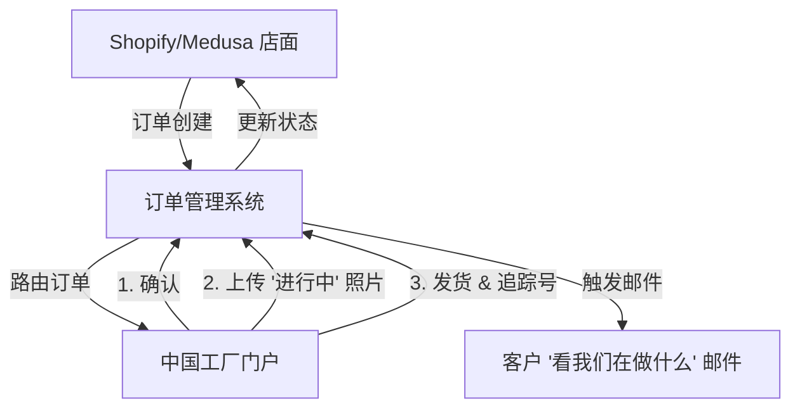

# 2025年定制刺绣毛巾供应链战略总体规划

**日期:** 2025-12-10
**执行发起人:** Big Dick
**状态:** 需要战略转型

---

## 1. 以此总体规划为核心的执行摘要：现实核查

本总体规划将最初的头脑风暴与严格的领域研究相结合。最初关于“快速、廉价、无摩擦”的中国到加拿大代发货模式的假设，已经根据2025年的物流和监管现实进行了压力测试。

**结论:** “商品代发货”模式因三个关键障碍而**不可行**:
1.  **速度陷阱:** 本地竞争对手 (Printful) 可在2-5天内交货。基于中国的ePacket (15-45天) 无法在标准实用毛巾上与之竞争。
2.  **关税冲击:** 每一笔进口都需缴纳 **17%的最惠国关税 (MFN Duty)** + **5%的GST**。海关没有“顺风车”可搭。
3.  **标签壁垒:** 通用供应商很少符合加拿大纺织品标签法要求的严格 **英/法双语标签** 法律。

**转型:** 利用 "Grace's Towel" 品牌，从 **“快速实用”** 转型为 **“慢时尚奢华”**。
我们销售的是 **事实上更优越的产品** (长绒棉，超高质量)，直接与 Frontgate 和 Brooklinen 等品牌竞争，以此证明3周的等待时间和约23%的落地税费成本是合理的。

---

## 2. 战略转型：“等待的艺术”

为了在物流差距中生存，我们必须从根本上改变价值主张。

| 特征 | 旧模式 (商品化) | 新模式 (奢华转型) |
| :--- | :--- | :--- |
| **产品** | 标准棉毛巾 | 竹纤维/华夫格编织 (独特) |
| **价值主张** | “比亚马逊便宜” | “比 Printful 更好” |
| **运输** | “希望快点” (15天) | “手工制作” (20天) |
| **透明度** | 黑盒 | **可视化生产追踪 (登月策略)** |
| **合规性** | “躲避雷达” | **严格的双语合规** |

### 关键差异化因素
1.  **可视化质检 (登月策略):** 使用App向客户发送 *他们* 的特定毛巾在工厂刺绣的照片。这把“等待时间”变成了“期待时间”。这是一个雄心勃勃的目标，但值得一试。
2.  **合规即质量:** 将“合法进口”状态 (安全染料，公平劳动) 营销为一项高级特性。

---

## 3. 更新后的实施路线图

### **第一阶段：基础与数据收集 (第 1-2 周)**
**目标:** 收集所有成本数据并建立定价策略

**并行研究轨道:**
- **轨道 A:** 隐性费用与运输研究 (如上详述)
- **轨道 B:** 原材料与履行成本研究
- **轨道 C:** 竞争分析与市场定价研究

**关键里程碑:** 在任何系统开发之前完成包含定价策略的成本模型

### **第 1.5 阶段：定价策略定稿 (第 2 周末)**
**目标:** 在构建系统之前锁定定价
**交付物:**
- 所有产品类别的最终定价
- 运输成本阈值
- 利润目标和盈亏平衡分析
- 客户定价分层 (标准 vs. 快递)

### **第二阶段：系统开发 (第 3-4 周)**
**目标:** 基于最终定价数据构建系统
- 具有实际成本阈值的智能运输逻辑
- 具有真实利润率的动态定价集成
- 具有真实成本比较的订单拆分算法

### **第三阶段：发布与微履行 (第 7-8 周+)**
**目标:** 发布并计划向本地速度迁移。
- **Epic 5:** 店铺发布与客户体验。
- **Epic 6:** 加拿大微履行试点 (未来)。

---

## 4. 详细的史诗 (Epics) 与用户故事 (User Stories)

### **Epic 1: 采购与合规验证 (已完成)**
**目标:** 确保供应链不会在边境被扣押。

- **1.1 双语标签验证**
  - *作为企业主，我要验证我的供应商可以缝制符合加拿大合规要求的标签，以免货物被扣押和销毁。*
  - **状态:** **已验证**。
  - **可执行任务:**
    1.  索取英/法标签制造能力的实物照片样品。
    2.  验证供应商的“经销商身份”(CA 编号) 或使用我们自己的编号的能力。
    3.  确认纤维成分披露符合加拿大“纺织品标签和广告条例”。

- **1.2 强迫劳动尽职调查 (S-211 法案)**
  - *作为企业主，我要确认我的棉花来源，以遵守加拿大对强迫劳动产品的禁令。*
  - **状态:** **已验证**。
  - **可执行任务:**
    1.  获取原材料棉花的原产地证书。
    2.  绘制供应链层级图 (农场 -> 纺纱厂 -> 织造厂 -> 工厂)。
    3.  将文件保存在 "Compliance/S-211" 网盘文件夹中以备潜在审计。

- **1.3 垂直供应商搜索 (已推迟)**
  - *作为企业主，我想调查是否有一家工厂可以同时进行织造和刺绣以节省时间。*
  - **状态:** 因规模原因 **已推迟**。
  - **可执行任务:**
    1.  一旦月订单量 > 500 件，重新评估垂直供应商。

### **Epic 2: 综合财务建模与成本情报**
**目标:** 在发布前发现每一项隐性费用以确保盈利。

- **2.1 加拿大海关与进口关税研究**
  - *作为企业主，我需要清晰的费用结构以避免意外账单。*
  - **可执行任务:**
    1.  **联系 CBSA/报关行:** 确认毛巾的进口关税率 (可能的 HS 编码: 6302.60.00)。
    2.  **税收映射:** 按省份绘制 GST/HST 税率 (5-15%)。
    3.  **报关费:** 获取单独清关行与承运商集成清关的费用表。
    4.  **检查成本:** 研究潜在的 CBSA 检查费。

- **2.2 承运商特定费用矩阵**
  - *作为企业主，我希望全面比较“隐性”承运商附加费。*
  - **可执行任务:**
    1.  **附加费:** 从 ePacket, DHL, 和 SF Express 获取详细的附加费清单 (燃油, 偏远地区, 住宅派送)。
    2.  **体积重:** 验证每家承运商的“超大”费用和体积重除数。
    3.  **货币:** 检查承运商汇率 (通常有溢价) 与市场汇率的对比。
    4.  **保险:** 比较可选保险成本 (价值的 %)。

- **2.3 处理与操作费验证**
  - *作为企业主，我想知道本地合作伙伴增加的“最后一公里”成本。*
  - **可执行任务:**
    1.  **加拿大邮政:** 研究进口国际包裹的处理费 (特别是 ePacket vs. 普通邮件)。
    2.  **交付异常:** 确定“签名确认”、“投递失败尝试”和“地址更正”的成本。
    3.  **仓储:** 检查邮政设施潜在的包裹保管费。

- **2.4 总落地成本计算器**
  - *作为企业主，我想要一个基于真实数据生成准确客户报价的工具。*
  - **可执行任务:**
    1.  **建立模型:** 创建集成表格: `产品 + 刺绣 + 中国国内运费 + 国际基础费率 + 附加费 + 关税 + GST + 报关费 + 缓冲`。
    2.  **场景规划:** 为 1条毛巾, 2条毛巾, 和 3条毛巾的场景创建费用矩阵。
    3.  **利润验证:** 确保利润率达到“奢华”目标。

- **2.5 综合成本数据收集**
  - *作为企业主，我希望在定价前收集所有成本组件。*
  - **可执行任务:**
    1.  **直接产品成本:**
        - 原始毛巾每单位成本 (含批量折扣)。
        - 每个设计/复杂程度的刺绣成本。
        - 包装材料 (可回收袋, 真空密封设备)。
    2.  **履行与物流成本:**
        - 中国仓库接收/处理费。
        - 仓库 → 刺绣工厂运费。
        - 刺绣工厂 → 仓库退回运费。
        - 国际运输 (所有场景: <2kg, >2kg, 拆分订单)。
        - 上述研究中的所有隐性费用。
    3.  **运营成本:**
        - 质量控制抽样 (寄送样品给自己)。
        - 缺陷产品更换成本。
        - 缺陷发放的商店信用 (估计 %)。
        - 平台集成和 API 成本。
        - 支付处理费。
    4.  **风险与缓冲成本:**
        - 货币波动缓冲 (CAD/USD/CNY)。
        - 损坏商品更换率 (估计 %)。
        - 投递失败重新发货成本。
        - 季节性运费变化。

- **2.6 "奢华" 定价与现金流策略**
  - *作为企业主，我希望定价以获得高利润率并管理现金流安全。*
  - **可执行任务:**
    1.  **定价:** 对标 Frontgate/Pottery Barn; 设定建议零售价 (MSRP) > 3.5倍 总落地成本。
    2.  **现金流:** 计算销售回款天数 (DSO) vs. 应付账款天数 (DPO); 模拟 $10k 预算的资金跑道。
    3.  **风险:** 定义“可接受损失”率 (例如 5%) 并确保 3PL 流程的保险覆盖。

- **2.7 定价策略框架**
  - *作为企业主，我想要一套严格的方法论来设定价格。*
  - **可执行任务:**
    1.  **成本细分:** 按产品类别 (毛巾, 浴袍等) 完成细分。
    2.  **利润分析:** 计算最低可行利润率 vs. 理想奢华利润率。
    3.  **竞争:** 与直接竞争对手进行比较分析。
    4.  **支付意愿:** 研究客户对“定制” vs “标准”的价格敏感度。
    5.  **盈亏平衡:** 在不同销量水平 (10, 50, 100 单位/月) 进行分析。
  - **集成点:** 此定价研究与第一阶段并行进行，并为所有系统提供信息。

### **Epic 3: 物流与 >2kg 运输优化**
**目标:** 解决“重包裹”问题并突破运输限制。

- **3.1 详细运输选项研究 (>2kg)**
  - *作为企业主，我想要确定超过 2kg ePacket 限制的包裹的最佳承运商。*
  - **状态:** **需要研究**。
  - **可执行任务:**
    1.  获取 2.5kg, 5kg, 和 10kg 包裹的费率卡，来自: **SF Express (顺丰)**, **DHL eCommerce**, **YunExpress (云途)**, 和 **4PX (递四方)**。
    2.  比较每家承运商的运输时间 vs. 成本。
    3.  确定哪些承运商提供 DDP (完税后交货) vs DDU (未完税交货)。

- **3.2 智能订单拆分逻辑**
  - *作为系统，我希望自动确定将大订单拆分为两个小 ePacket 包裹是否更便宜。*
  - **可执行任务:**
    1.  定义 `SPLIT_THRESHOLD` (例如: 如果总重量 > 2kg)。
    2.  开发算法: `IF (2x ePacket 成本) < (1x DHL 成本) THEN 拆分`。
    3.  实施后端逻辑以为一个订单生成两个运输标签。

- **3.3 真空密封可行性测试**
  - *作为企业主，我想测试真空密封是否能减少体积重以节省资金。*
  - **可执行任务:**
    1.  订购 1条样品毛巾并进行真空密封。
    2.  测量“前” vs “后”的尺寸。
    3.  使用体积重公式 (长*宽*高/6000) 计算节省的费用。
    4.  验证打开后的褶皱恢复情况 (看起来还显高档吗？)。

- **3.4 快递运输集成**
  - *作为高价值客户，我愿意额外支付费用以获得 5-7 天的运输服务，这样我就不必等待。*
  - **可执行任务:**
    1.  **承运商选择:** 确定一家提供可靠 <7 天运输的“高级承运商” (例如 FedEx IP, DHL Express, 顺丰国际)。
    2.  **定价层级:** 计算向客户收取的“快递附加费” (例如 $25 固定费用)。
    3.  **结账逻辑:** 仅在预计交货日期有保证时才启用此运输方式。

### **Epic 4: "透明厨房" 技术**
**目标:** 让等待时间成为一种体验，而不是延误。

- **4.1 可视化质检 App (登月策略)**
  - *作为客户，我想看到 **我的** 独特毛巾被缝制的照片。*
  - **状态:** **高优先级**。
  - **可执行任务:**
    1.  为工厂工人设计一个简单的“移动网页表单”。
    2.  功能: 扫描订单条形码 -> 拍照 -> 上传 -> “完成”。
    3.  后端: 触发带有照片附件的“生产完成”电子邮件。

- **4.2 透明时间轴集成**
  - *作为客户，我想要详细的追踪更新，这样我在3周的等待期间不会觉得被“放鸽子”。*
  - **可执行任务:**
    1.  映射详细状态: “棉花采购”, “织造”, “刺绣”, “质检完成”, “已发货”。
    2.  通过店面的“订单状态”页面展示这些状态。

### **Epic 5: 中国履行中心 (3PL) 策略**
**目标:** 建立一个物理“指挥中心”来管理复杂的库存流。

- **5.1 3PL 可行性与选择**
  - *作为企业主，我想要一个能够处理“乒乓”物流 (接收半成品 -> 发往工厂 -> 接收定制品 -> 发给客户) 的仓库合作伙伴。*
  - **状态:** **关键缺口**。
  - **可执行任务:**
    1.  确定 3-5 家位于毛巾制造商附近的 3PL 供应商 (以最小化入库运费)。
    2.  **验证特殊工作流:** 他们能否拆箱散货、清点数量，并重新发运特定数量到刺绣工厂？
    3.  **验证质检接收:** 他们能否在最终包装前检查 *返回* 的刺绣毛巾？
    4.  获取“拣货与包装” vs. “特殊处理”的定价 (因为这不是标准的电子商务)。

- **5.2 库存与 API 集成**
  - *作为企业主，我希望我的商店确切知道库存位于何处 (仓库 vs. 工厂)。*
  - **可执行任务:**
    1.  调查入围 3PL 的 WMS (仓库管理系统) API。
    2.  定义“虚拟仓储”逻辑: 当 50 条毛巾去刺绣时，它们在系统中移动到“WIP” (在制品) 位置。

---

## 5. 透明化技术架构

为了支持 **可视化质检** 策略，技术栈必须进化:

**关键要求:** “中国工厂门户”必须极其简单 (移动端友好)，以便工厂工人拍照和扫描条形码。

---

## 6. 风险评估与缓解

| 风险 | 可能性 | 影响 | 缓解策略 |
| :--- | :--- | :--- | :--- |
| **海关扣押** | 中 | 严重 | **严格的双语标签** (Epic 1.1) |
| **客户愤怒 (速度)** | 高 | 高 | **"可视化质检" 照片** (Epic 3.1) + 清晰的 "20天手工制作" 信息。 |
| **退货率** | 中 | 中 | 定制商品 **无退货** 政策 + 仅提供商店信用。 |
| **关税利润侵蚀** | 确定 | 高 | **高定价策略** (Epic 2.2). |

---

## 7. 未来路线图："加拿大中心" (2025年第三季度)

一旦销量达到 >50 单/月，我们再次转型物流:

1.  **批量进口半成品:** 海运 500+ 条毛巾到一个小的加拿大工作空间 (车库/仓库)。
2.  **本地刺绣:** 雇佣本地学生或与小店合作处理“加急”订单。
3.  **混合模式:** 中国保留“奇怪/定制”库存，加拿大用于“核心畅销品”。

---

**批准:**
_本文件作为 Grace's Towel 供应链优化项目的授权总体规划。_
