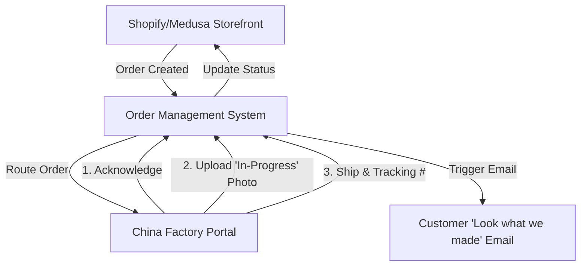

# Strategic Supply Chain Master Plan 2025: Custom Embroidered Towels

**Date:** 2025-12-10
**Executive Sponsor:** Big Dick
**Status:** Strategic Pivot Required

---

## 1. Executive Summary: The Reality Check

This Master Plan consolidates initial brainstorming with rigorous domain research. The original assumptions of a "fast, cheap, frictionless" China-to-Canada dropshipping model have been stress-tested against 2025 logistics and regulatory realities.

**The Verdict:** The "Commodity Dropshipping" model is **unviable** due to three critical barriers:
1.  **The Speed Trap:** Local competitors (Printful) deliver in 2-5 days. China-based ePacket (15-45 days) cannot compete for standard utility towels.
2.  **The Duty Surprise:** A **17% MFN Duty** + **5% GST** applies to every import. There is no "free ride" at customs.
3.  **The Labeling Wall:** Generic suppliers rarely meet the strict **English/French bilingual labeling** laws required by the Canadian Textile Labelling Act.

**The Pivot:** Use the "Grace's Towel" brand to shift from **"Fast Utility"** to **"Slow Luxury"**.
We are selling **Factually Superior Product** (long staple cotton, super high quality) that competes directly with brands like Frontgate and Brooklinen, justifying the 3-week wait and the ~23% landed tax cost.

---

## 2. Strategic Pivot: "The Art of the Wait"

To survive the logistics gap, we must fundamentally change the value proposition.

| Feature | Old Model (Commodity) | New Model (Luxury Pivot) |
| :--- | :--- | :--- |
| **Product** | Standard Cotton Towel | Bamboo/Waffle Weave (Unique) |
| **Value Prop** | "Cheaper than Amazon" | "Better than Printful" |
| **Shipping** | "Hopefully fast" (15 days) | "Hand-Crafted" (20 days) |
| **Transparency** | Black Box | **Visual Production Tracking (Moonshot Strategy)** |
| **Compliance** | "Fly under radar" | **Strict Bilingual Compliance** |

### Key Differentiators
1.  **Visual QC (Moonshot Strategy):** Use an app to send customers a photo of *their* specific towel being embroidered in the factory. This turns "waiting time" into "excitement time". It is an ambitious goal but worth trying.
2.  **Compliance as Quality:** Marketing the "Legal Import" status (safe dyes, fair labor) as a premium feature.

---

## 3. UPDATED Implementation Roadmap

### **Phase 1: Foundation & Data Collection (Weeks 1-2)**
**Goal:** Gather ALL cost data and establish pricing strategy

**Parallel Research Tracks:**
- **Track A:** Hidden fees & shipping research (as detailed above)
- **Track B:** Raw material & fulfillment cost research
- **Track C:** Competitive analysis & market pricing research

**Key Milestone:** Complete cost model with pricing strategy before any system development

### **Phase 1.5: Pricing Strategy Finalization (End of Week 2)**
**Goal:** Lock in pricing before building systems
**Deliverable:**
- Final pricing for all product categories
- Shipping cost thresholds
- Margin targets and break-even analysis
- Customer pricing tiers (standard vs. express shipping)

### **Phase 2: System Development (Weeks 3-4)**
**Goal:** Build systems with finalized pricing data
- Smart shipping logic with actual cost thresholds
- Dynamic pricing integration with real margins
- Order splitting algorithms with true cost comparisons

### **Phase 3: Launch & Micro-Fulfillment (Weeks 7-8+)**
**Goal:** Launch and plan the move to local speed.
- **Epic 5:** Store Launch & Customer Experience.
- **Epic 6:** Canadian Micro-Fulfillment Pilot (Future).

---

## 4. Detailed Epics & User Stories

### **Epic 1: Sourcing & Compliance Verification (COMPLETE)**
**Goal:** Secure a supply chain that won't get seized at the border.

- **1.1 Bilingual Label Verification**
  - *As a business owner, I want to verify my supplier can sew CA-compliant labels so that my goods aren't seized and destroyed.*
  - **Status:** **VERIFIED**.
  - **Actionable Tasks:**
    1.  Request physical photo sample of English/French label capabilities.
    2.  Verify supplier's "Dealer Identity" (CA Number) or ability to use ours.
    3.  Confirm fiber content disclosure meets Canadian "Textile Labelling and Advertising Regulations".

- **1.2 Forced Labor Due Diligence (Bill S-211)**
  - *As a business owner, I want to confirm my cotton source so that I comply with Canada's ban on forced labor goods.*
  - **Status:** **VERIFIED**.
  - **Actionable Tasks:**
    1.  Obtain Certificate of Origin for raw cotton materials.
    2.  Map supply chain tiers (Farm -> Spinner -> Weaver -> Factory).
    3.  Save documentation in "Compliance/S-211" drive folder for potential audits.

- **1.3 Vertical Supplier Search (DEFERRED)**
  - *As a business owner, I want to investigate if a single factory can do both weaving and embroidery to save time.*
  - **Status:** **DEFERRED** due to scale.
  - **Actionable Tasks:**
    1.  Re-evaluate vertical suppliers once monthly order volume > 500 units.

### **Epic 2: Comprehensive Financial Modeling & Cost Intelligence**
**Goal:** Uncover every hidden fee to ensure profitability before launch.

- **2.1 Canadian Customs & Import Duties Research**
  - *As a business owner, I need a clear fee structure to avoid surprise bills.*
  - **Actionable Tasks:**
    1.  **Contact CBSA/Broker:** Confirm Import duty rate for towels (Likely HS Code: 6302.60.00).
    2.  **Tax Mapping:** Map GST/HST rates (5-15%) by province.
    3.  **Brokerage Fees:** Get fee schedules from separate clearance brokers vs. carrier-integrated clearance.
    4.  **Inspection Costs:** Research potential CBSA examination fees.

- **2.2 Carrier-Specific Fee Matrix**
  - *As a business owner, I want a complete comparison of "Hidden" carrier surcharges.*
  - **Actionable Tasks:**
    1.  **Surcharges:** Get detailed surcharge lists (Fuel, Remote Area, Residential Delivery) from ePacket, DHL, and SF Express.
    2.  **Dimensional Weight:** Verify "Oversized" fees and dim-weight divisors for each carrier.
    3.  **Currency:** Check carrier exchange rates (often padded) vs. market rates.
    4.  **Insurance:** Compare optional insurance costs (% of value).

- **2.3 Processing & Handling Fee Verification**
  - *As a business owner, I want to know the "Final Mile" costs added by local partners.*
  - **Actionable Tasks:**
    1.  **Canada Post:** Research handling fees for incoming international packages (specifically for ePacket vs. Regular Mail).
    2.  **Delivery Exceptions:** Identify costs for "Signature Confirmation", "Failed Delivery Attempts", and "Address Correction".
    3.  **Storage:** Check potential package holding fees at postal facilities.

- **2.4 Total Landed Cost Calculator**
  - *As a business owner, I want a tool to generate accurate customer quotes based on real data.*
  - **Actionable Tasks:**
    1.  **Build Model:** Create a spreadsheet integrating: `Product + Embroidery + China Domestic Ship + Int'l Base Rate + Surcharges + Duty + GST + Brokerage + Buffer`.
    2.  **Scenario Planning:** Create fee matrices for 1-towel, 2-towel, and 3-towel scenarios.
    3.  **Profit verification:** ensuring margin meets the "Luxury" target.

- **2.5 Comprehensive Cost Data Collection**
  - *As a business owner, I want to gather ALL cost components before setting prices.*
  - **Actionable Tasks:**
    1.  **Direct Product Costs:**
        - Raw towel cost per unit (including bulk discounts).
        - Embroidery cost per design/complexity level.
        - Packaging materials (recyclable bags, vacuum sealing equipment).
    2.  **Fulfillment & Logistics Costs:**
        - China warehouse receiving/handling fees.
        - Warehouse → embroidery factory shipping.
        - Embroidery factory → warehouse return shipping.
        - International shipping (all scenarios: <2kg, >2kg, split orders).
        - All hidden fees from research above.
    3.  **Operational Costs:**
        - Quality control sampling (shipping samples to yourself).
        - Defective product replacement costs.
        - Store credit issued for defects (estimated %).
        - Platform integration and API costs.
        - Payment processing fees.
    4.  **Risk & Buffer Costs:**
        - Currency fluctuation buffer (CAD/USD/CNY).
        - Damaged goods replacement rate (estimated %).
        - Failed delivery reshipment costs.
        - Seasonal shipping rate variations.

- **2.6 "Luxury" Pricing & Cash Flow Strategy**
  - *As a business owner, I want to price for premium margins and manage cash flow safety.*
  - **Actionable Tasks:**
    1.  **Pricing:** Benchmark vs. Frontgate/Pottery Barn; Set MSRP > 3.5x Total Landed Cost.
    2.  **Cash Flow:** Calculate Days Sales vs. Days Payable; Model $10k budget runway.
    3.  **Risk:** Define "Acceptable Loss" rate (e.g., 5%) and ensure insurance coverage for 3PL flows.

- **2.7 Pricing Strategy Framework**
  - *As a business owner, I want a rigorous methodology to set prices.*
  - **Actionable Tasks:**
    1.  **Cost Breakdown:** Complete breakdown per product category (Towel, Robe, etc.).
    2.  **Margin Analysis:** Calculate Minimum Viable Margins vs. Ideal Luxury Margins.
    3.  **Competition:** Comparative analysis vs. direct competitors.
    4.  **Willingness-to-Pay:** Research customer price sensitivity for "Custom" vs "Standard".
    5.  **Break-Even:** Analysis at different volume levels (10, 50, 100 units/mo).
  - **Integration Point:** This pricing research happens in parallel with Phase 1 and informs all systems.

### **Epic 3: Logistics & >2kg Shipping Optimization**
**Goal:** Solve the "Heavy Package" problem and reduce shipping limits.

- **3.1 Detailed Shipping Options Research (>2kg)**
  - *As a business owner, I want to identify the best carriers for packages over the 2kg ePacket limit.*
  - **Status:** **RESEARCH REQUIRED**.
  - **Actionable Tasks:**
    1.  Get rate cards for 2.5kg, 5kg, and 10kg packages from: **SF Express**, **DHL eCommerce**, **YunExpress**, and **4PX**.
    2.  Compare transit times vs. cost for each carrier.
    3.  Identify which carriers offer DDP (Delivered Duty Paid) vs DDU (Delivered Duty Unpaid).

- **3.2 Smart Order Splitting Logic**
  - *As a system, I want to automatically determine if a large order is cheaper to ship as two small ePackets.*
  - **Actionable Tasks:**
    1.  Define the `SPLIT_THRESHOLD` (e.g., if Total Weight > 2kg).
    2.  Develop algorithm: `IF (2x ePacket Cost) < (1x DHL Cost) THEN Split`.
    3.  Implement backend logic to generate two shipping labels for one order.

- **3.3 Vacuum Sealing Feasibility Test**
  - *As a business owner, I want to test if vacuum sealing reduces volumetric weight enough to save money.*
  - **Actionable Tasks:**
    1.  Order 1 sample towel and vacuum seal it.
    2.  Measure "Before" vs "After" dimensions.
    3.  Calculate savings using Volumetric Weight formulas (L*W*H/6000).
    4.  Verify wrinkle recovery after opening (does it look premium?).

- **3.4 Express Shipping Integration**
  - *As a high-value customer, I want to pay extra for 5-7 day shipping so I don't have to wait.*
  - **Actionable Tasks:**
    1.  **Carrier Selection:** Identify a "Premium Carrier" (e.g., FedEx IP, DHL Express, SF International) that offers reliable <7 day transit.
    2.  **Pricing Tier:** Calculate the "Express Surcharge" to charge the customer (e.g., $25 flat fee).
    3.  **Checkout Logic:** Enable this shipping method only if the estimated delivery date is guaranteed.

### **Epic 4: "Transparent Kitchen" Technology**
**Goal:** Make the waiting time an experience, not a delay.

- **4.1 Visual QC App (Moonshot Strategy)**
  - *As a customer, I want to see a photo of **my** unique towel being sewn.*
  - **Status:** **HIGH PRIORITY**.
  - **Actionable Tasks:**
    1.  Design a simple "Mobile Web Form" for factory workers.
    2.  Features: Scan Order Barcode -> Take Photo -> Upload -> "Done".
    3.  Backend: Trigger "Production Complete" email with the photo attachment.

- **4.2 Transparency Timeline Integration**
  - *As a customer, I want granular tracking updates so I don't feel "ghosted" during the 3-week wait.*
  - **Actionable Tasks:**
    1.  Map granular statuses: "Cotton Sourcing", "Weaving", "Embroidering", "Quality Checked", "Shipped".
    2.  Expose these statuses via an "Order Status" page on the storefront.

### **Epic 5: China Fulfillment Hub (3PL) Strategy**
**Goal:** Establish a physical "Command Center" to manage the complex inventory flow.

- **5.1 3PL Feasibility & Selection**
  - *As a business owner, I want a warehouse partner who can handle the "Ping-Pong" logistics (Receive Blanks -> Ship to Factory -> Receive Custom -> Ship to Customer).*
  - **Status:** **CRITICAL GAP**.
  - **Actionable Tasks:**
    1.  Identify 3-5 3PL providers located near the towel manufacturer (to minimize inbound freight).
    2.  **Verify Special Workflows:** Can they unbox bulk, count, and re-ship specific quantities to the embroidery factory?
    3.  **Verify QC Receipt:** Can they inspect the *returning* embroidered towels before final packaging?
    4.  Get pricing for "Pick & Pack" vs. "Special Handling" (since this isn't standard e-commerce).

- **5.2 Inventory & API Integration**
  - *As a business owner, I want my store to know exactly where the inventory is (Warehouse vs. Factory).*
  - **Actionable Tasks:**
    1.  Investigate WMS (Warehouse Management System) APIs of shortlisted 3PLs.
    2.  Define "Virtual Warehousing" logic: When 50 towels go to embroidery, they move to a "WIP" (Work In Progress) location in the system.

---

## 5. Technical Architecture for Transparency

To support the **Visual QC** strategy, the tech stack must evolve:

**Key Requirement:** The "China Factory Portal" must be incredibly simple (mobile friendly) for factory workers to snap a photo and scan a barcode.

---

## 6. Risk Assessment & Mitigation

| Risk | Probability | Impact | Mitigation Strategy |
| :--- | :--- | :--- | :--- |
| **Customs Seizure** | Medium | Critical | **Strict Bilingual Labeling** (Epic 1.1) |
| **Customer Rage (Speed)** | High | High | **"Visual QC" Photos** (Epic 3.1) + Clear "Crafted in 20 Days" messaging. |
| **Return Rate** | Medium | Medium | **No Returns** policy on custom items + Store Credit only. |
| **Duty Margin Erosion** | Certain | High | **High Pricing Strategy** (Epic 2.2). |

---

## 7. Future Roadmap: The "Canada Hub" (Q3 2025)

Once volume hits >50 orders/month, we pivot logistics again:

1.  **Import Blanks in Bulk:** Sea freight 500+ towels to a small Canadian workspace (Garage/Storage).
2.  **Local Embroidery:** Hire a local student or partner with a small shop for "Rush" orders.
3.  **Hybrid Model:** Keep China for "Weird/Custom" inventory, use Canada for "Core Best-Sellers".

---

**Approval:**
_This document serves as the authorized master plan for the Grace's Towel supply chain optimization project._
