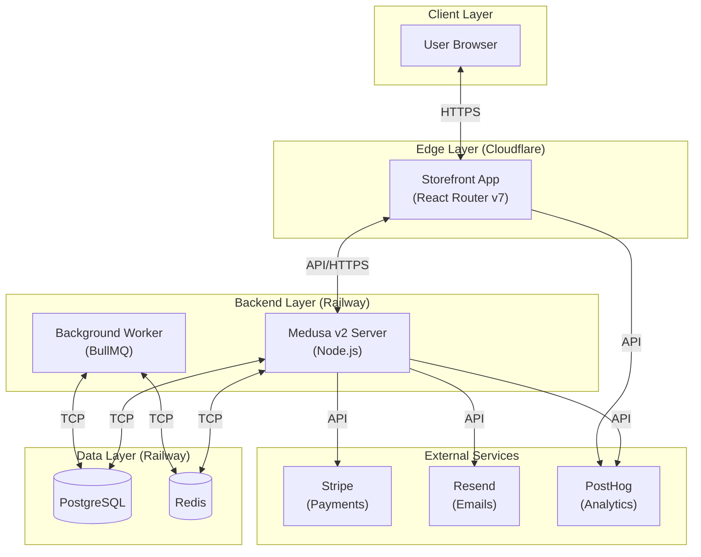

# System Architecture & Decisions

## System Overview



_This document builds collaboratively through step-by-step discovery. Sections are appended as we work through eachher._

## Project Context Analysis

### Requirements Overview

**Three Feature Integration Scope:**

This architecture addresses three distinct features being integrated into the existing gracestowel headless commerce platform:

1. **PostHog Analytics Integration (4 Epics, 16+ Stories)**
   - Foundational event tracking (client-side SDK initialization, key events)
   - Comprehensive data capture with user identification (server-side tracking, logged-in user association)
   - Admin analytics dashboarding (metrics visualization, filtering/segmentation, dashboard access)
   - Production monitoring & observability (error tracking, Web Vitals, API latency, health checks)

2. **Cookie Policy Popup (1 Epic, 3 Stories)**
   - Legal compliance notification (first-visit display, humorous tone)
   - Non-intrusive UI design (dismissible, no content blocking)
   - Persistent state management (localStorage-based)

3. **Transparent Pricing & Impact (6 Epics, Complex)**
   - Core pricing engine with admin configuration (product cost data modeling)
   - Dynamic cost integration service (Cloudflare/Railway, Meta/Google/TikTok APIs, payment fees)
   - Real-time price calculation with session locking
   - Storefront transparency experience (interactive breakdown UI, cost tooltips, impact visualization)
   - Charity integration (Tree Nation, CanadaHelps APIs with fail-open)
   - Price lock guarantee system (monitoring, automated credits, notifications)

**Functional Requirements Summary:**

- **PostHog Integration (7 FRs):** Event capture, user identification, client/server-side tracking, dashboard access, filtering
- **Cookie Policy (6 FRs):** First-visit display, informative content, non-intrusive design, dismissal, persistence, legal compliance
- **Transparent Pricing (14 FRs):** Cost configuration, dynamic fetching, price calculation, session locking, breakdown UI, charity triggers, price monitoring

**Non-Functional Requirements:**

- **Performance:**
  - Analytics data available within 2 hours (PostHog)
  - No noticeable degradation from integrations
  - PDP load time impact <100ms (Transparent Pricing)
  - Price calculation latency <50ms
  - Cookie popup fast load, no page delay

- **Security:**
  - User data pseudonymization/anonymization (PostHog)
  - HTTPS for all external data transmission
  - Role-based access to sensitive analytics
  - No sensitive data storage in cookie popup

- **Scalability:**
  - PostHog integration handles traffic increases seamlessly
  - Cookie popup: browser-compatible, responsive
  - Transparent Pricing: API caching (15-60 min TTL) to prevent rate limits

- **Reliability:**
  - Charity API fail-open (don't block checkout)
  - Price stability (dampened updates, session locking)
  - Graceful PostHog degradation (no API key = no crash)

- **Accessibility:**
  - Cookie popup: keyboard navigation, screen reader support, color contrast (WCAG compliance)

**Scale & Complexity:**

- **Primary domain:** Full-Stack E-commerce (Headless Architecture)
- **Complexity level:** High
- **Estimated architectural components:**
  - 3 new backend modules/services (Analytics Events, Pricing Engine, Charity Integration)
  - 5+ new API endpoints (reviews, impact data, price calculation)
  - 8+ new storefront components (CookieConsent, PriceBreakdown, ImpactBadge, etc.)
  - 4+ external API integrations (PostHog, Tree Nation, CanadaHelps, Infrastructure/Marketing APIs)
  - 2+ background jobs (price monitoring cron, async donation processing)

### Technical Constraints & Dependencies

**Existing System Constraints:**

- **Backend:** Medusa v2.12.0 on Railway (PostgreSQL 16, Redis 7, Node.js 24)
- **Storefront:** React Router v7 on Cloudflare Workers (edge runtime, serverless constraints)
- **Current Integrations:** Stripe (payments), Resend (emails), PostHog (partial setup)
- **Module Pattern:** Custom Medusa modules (Review module exists as reference pattern)
- **Workflow System:** Event-driven workflows for business logic
- **State Management:** React Context API (Cart, Customer, Wishlist, Locale)

**Dependencies:**

- PostHog SDKs: `posthog-node@5.14.1` (backend), `posthog-js` (storefront) - already installed
- External APIs: Cloudflare API, Railway API, Meta Marketing API, Google Ads API, TikTok Ads API, Tree Nation API, CanadaHelps API
- Redis: Required for caching external API responses
- TypeScript: Full type safety across stack (v5.6.2 backend, v5.9.2 storefront)

**Deployment Constraints:**

- Edge deployment limits: No long-running processes on Cloudflare Workers (use async jobs on backend)
- Serverless considerations: PostHog immediate flushing required for Railway
- CORS configuration: Frontend on Cloudflare, backend on Railway (already configured)

### Cross-Cutting Concerns Identified

**1. Privacy & Consent Management**
- Cookie policy must gate analytics initialization
- User consent state affects PostHog tracking
- GDPR/compliance considerations for all tracking
- Decision: Cookie consent check before any analytics capture

**2. Caching Strategy**
- External API data must be cached to prevent rate limits and latency
- TTL requirements: 15 min (ad spend), 60 min (infrastructure costs)
- Storage: Redis cache layer (already available)
- Cache invalidation: Time-based, no manual invalidation needed

**3. Error Handling & Graceful Degradation**
- PostHog failures: Continue operation, log errors
- Charity API failures: Complete checkout, retry async
- External cost API failures: Fall back to static estimates or previous values
- Pattern: Fail-open for non-critical integrations

**4. Performance Monitoring**
- Web Vitals tracking (LCP, FID, CLS) - PostHog integration
- API latency monitoring - custom events
- Error rate tracking - exception capture
- Health check monitoring - automated pings

**5. Type Safety & Code Consistency**
- TypeScript strict mode across frontend/backend
- Shared type definitions for API contracts
- Module-based architecture for separation of concerns
- Workflow pattern for complex business logic

**6. Session & State Management**
- Price locking requires session persistence
- Cart state coordination with locked prices
- User authentication state for analytics identification
- localStorage + backend coordination pattern

**7. External Integration Resilience**
- Multiple third-party APIs (infrastructure, marketing, charity)
- Circuit breaker pattern consideration
- Retry logic for transient failures
- Monitoring integration health

## Base Architecture Foundation

### Existing System Overview

This project is a **brownfield integration** - we are extending an existing, production-ready headless commerce platform rather than starting from scratch. The base architecture is already established and operational.

**Architecture Pattern:** Headless Commerce (Decoupled Frontend/Backend)

### Backend Architecture (Medusa v2)

**Core Framework:**
- **Platform:** Medusa v2.12.0 (headless commerce framework)
- **Runtime:** Node.js 24+
- **Language:** TypeScript v5.6.2 (strict mode)
- **Deployment:** Railway (containerized)

**Data Layer:**
- **Primary Database:** PostgreSQL 16 with SSL
- **Cache:** Redis 7 (BullMQ for job queues)
- **ORM:** Medusa internal ORM with TypeScript models

**Architectural Patterns:**
- **Module System:** Custom business logic in Medusa modules (example: Review module)
- **Workflow System:** Event-driven workflows for complex operations
- **Event Subscribers:** Async handlers for domain events (order-placed, customer-created, etc.)
- **API Routes:** File-based routing (`/api/[store|admin|webhooks]/{resource}/route.ts`)

**Existing Custom Modules:**
- `Review Module`: Product reviews with verified purchase tracking, auto-approval logic
- `Resend Module`: Email notification provider with React Email templating

**Current Integrations:**
- Stripe (payment processing with webhooks)
- Resend (transactional emails)
- PostHog (server-side tracking - partially implemented)

### Storefront Architecture (React Router v7)

**Core Framework:**
- **Platform:** React Router v7.9.2 with SSR
- **React Version:** v19.1.1
- **Language:** TypeScript v5.9.2
- **Build Tool:** Vite v7.1.7
- **Deployment:** Cloudflare Workers (edge deployment)

**Styling:**
- **Framework:** TailwindCSS v4.1.13
- **Approach:** Utility-first with custom design tokens
- **Theme:** Earthy palette (Alegreya serif, Sigmar One display fonts)

**State Management:**
- **Pattern:** React Context API
- **Contexts:** CartContext, CustomerContext, LocaleContext, WishlistContext
- **Persistence:** localStorage for cart/wishlist, backend for customer auth

**Component Architecture:**
- Feature-based organization (`app/components/`)
- Reusable UI components (ProductCard, CheckoutForm, ReviewSection)
- Route-based code splitting (React Router file-based routing)

**API Client Pattern:**
- Server-side: `createMedusaClient()` in loaders (type-safe)
- Client-side: Fetch via `/api/$` proxy route
- Type definitions: Shared types in `app/lib/medusa.ts`

**Current Integrations:**
- PostHog (client-side tracking - partially implemented with Web Vitals)
- Stripe Elements (checkout payment form)

### Infrastructure & Deployment

**Backend (Railway):**
- PostgreSQL 16 service (managed)
- Redis 7 service (managed)
- Docker multi-stage build
- Auto-migration on deployment
- Environment variables via Railway dashboard

**Storefront (Cloudflare Workers):**
- Edge SSR globally distributed
- Hyperdrive for database access from edge
- Wrangler configuration for staging/production environments
- Node.js compatibility mode enabled

**Local Development:**
- Docker Compose for full stack (PostgreSQL, Redis, backend, storefront)
- Hot reload on both apps
- Shared network: `gracestowel-network`

### Testing Infrastructure

**Backend Testing:**
- **Framework:** Jest with SWC transpiler
- **Types:** Unit tests (`*.unit.spec.ts`), Integration tests (`integration-tests/http/`)
- **Database:** Separate test database with Docker Compose

**Storefront Testing:**
- **Framework:** Vitest v3.2.4
- **Libraries:** @testing-library/react, happy-dom
- **Mocking:** MSW (Mock Service Worker)

**E2E Testing:**
- **Framework:** Playwright v1.49.0
- **Location:** Separate `apps/e2e` workspace
- **Execution:** Docker-based for CI consistency

### Architectural Patterns & Conventions

**Backend Patterns:**
- Custom modules for domain logic (`src/modules/{module-name}/`)
- Workflows for complex operations (`src/workflows/`)
- Event subscribers for async operations (`src/subscribers/`)
- Migration-based schema evolution
- Fail-open for non-critical integrations

**Storefront Patterns:**
- Server-side rendering with streaming
- Route-based code splitting
- Context providers for global state
- Type-safe API clients
- Error boundaries with PostHog capture

**Code Quality:**
- TypeScript strict mode across stack
- ESLint + Prettier configured
- Git hooks for pre-commit validation
- Type-safe API contracts

### Integration Points for New Features

**PostHog Analytics Enhancement:**
- Backend: `src/utils/posthog.ts` already configured with immediate flushing
- Storefront: `app/utils/posthog.ts` with autocapture enabled
- Pattern: Use existing subscribers for backend events, enhance storefront tracking

**Cookie Policy Implementation:**
- Location: `app/components/CookieConsent.tsx` (new)
- Insertion: `root.tsx` before provider stack
- Integration: Gate PostHog initialization based on consent state

**Transparent Pricing Module:**
- Pattern: Follow Review module architecture
- Location: `apps/backend/src/modules/pricing/` (new)
- API: New routes in `apps/backend/src/api/store/pricing/` (new)
- Storefront: New components in `app/components/` (PriceBreakdown, ImpactBadge)
- Caching: Leverage existing Redis layer

### Key Architectural Constraints

**Must Preserve:**
1. Existing module pattern (don't break Review module)
2. Workflow-based business logic approach
3. Type safety across frontend/backend
4. Edge deployment compatibility (no long-running processes on Workers)
5. Existing CORS configuration (Railway ↔ Cloudflare)

**Must Consider:**
1. Serverless constraints on Cloudflare Workers
2. Redis caching for external API calls
3. Graceful degradation for non-critical features
4. Session management for price locking
5. Event-driven architecture for async operations

---

**This base architecture provides the foundation for our three feature integrations. All new architectural decisions will build upon these established patterns.**

## Core Architectural Decisions

### Decision Priority Analysis

**Critical Decisions (Block Implementation):**
- PostHog event naming convention (simple_snake_case)
- Transparent Pricing module structure (New Medusa Module)
- External API client architecture (Individual Client Classes)
- Price calculation timing (Pre-calculated with daily cron job)
- Price locking mechanism (Cart-based locking)
- Fail-safe defaults (Last known good + static fallback)

**Important Decisions (Shape Architecture):**
- PostHog user identification strategy (Login + Registration + First Order)
- PostHog dashboard configuration (Pre-configured dashboards)
- Cookie consent granularity (Information-only, no consent needed)
- Charity integration pattern (Workflow-based integration)

**Deferred Decisions (Post-MVP):**
- Advanced PostHog features (session replay, feature flags)
- Price monitoring alert thresholds (can be adjusted post-launch)
- Additional charity integrations beyond Tree Nation/CanadaHelps

### PostHog Analytics Integration

**Decision 1.1: Event Naming Convention**
- **Choice:** Simple snake_case (`product_viewed`, `checkout_started`)
- **Rationale:** Clean, readable, industry standard, minimal cognitive overhead
- **Pattern:** `{noun}_{past_tense_verb}` (e.g., `order_placed`, `cart_updated`)
- **Affects:** All PostHog event capture across backend subscribers and storefront tracking

**Decision 1.2: User Identification Strategy**
- **Choice:** Login + Registration + First Order
- **Rationale:** Progressive identification balances privacy with analytics value
- **Implementation:**
  - Anonymous until login/registration → `posthog.identify(customer.id)`
  - Associate first purchase with customer identity
  - Backend: Event subscribers call `posthog.identify()` on `customer.created` and `order.placed`
  - Storefront: Client-side identify on auth state change
- **Affects:** Customer analytics, cohort analysis, retention tracking

**Decision 1.3: Dashboard Configuration**
- **Choice:** Pre-configured dashboards (no code generation)
- **Rationale:** PostHog UI provides sufficient flexibility, avoids maintenance burden
- **Dashboards to create:**
  - Overview: Traffic, conversions, revenue
  - Product Analytics: Views, add-to-cart rate, purchase funnel
  - Performance Monitoring: Web Vitals, API latency, error rates
- **Affects:** Admin analytics epic, dashboard access stories

**Decision 1.4: Error Capture Strategy**
- **Choice:** All errors with filtering
- **Rationale:** Comprehensive visibility with post-hoc filtering in PostHog UI
- **Implementation:**
  - Backend: Capture all exceptions via global error handler + PostHog
  - Storefront: Error boundaries capture React errors, send to PostHog
  - Filter noise in PostHog UI (e.g., known third-party errors)
- **Affects:** Production monitoring epic, observability stories

### Cookie Policy Integration

**Decision 2.1: Consent Granularity**
- **Choice:** Information-only (no consent required)
- **Rationale:** PostHog tracks admin analytics, not end-user PII; no optional tracking exists
- **Implementation:**
  - Display informational popup on first visit
  - Dismiss button stores `cookie_policy_seen=true` in localStorage
  - No consent toggles, no granular choices
  - Purely compliance notification, not consent mechanism
- **Affects:** Cookie popup UI, PostHog initialization timing

**Decision 2.2: PostHog Initialization Gating**
- **Choice:** No gating (initialize PostHog immediately)
- **Rationale:** Admin analytics for business metrics, not user behavior tracking; information-only popup
- **Implementation:**
  - PostHog initializes on app load (backend + storefront)
  - Cookie popup displays independently, purely informational
  - No blocking or consent checks before analytics
- **Affects:** PostHog SDK initialization, analytics capture timing

### Transparent Pricing & Impact Architecture

**Decision 3.1: Pricing Module Structure**
- **Choice:** New Medusa Module (`pricing-module`)
- **Rationale:** Follows existing pattern (Review module), encapsulates domain logic, type-safe integration
- **Module Structure:**
  ```
  apps/backend/src/modules/pricing/
  ├── models/
  │   ├── product-pricing.ts (cost data, breakdown, locked prices)
  │   └── pricing-cache.ts (last known good values)
  ├── services/
  │   ├── pricing.ts (core calculation logic)
  │   ├── external-api.ts (Cloudflare, Railway, Meta, Google, TikTok)
  │   └── charity.ts (Tree Nation, CanadaHelps integration)
  └── index.ts (module registration)
  ```
- **Affects:** All pricing-related stories, database migrations, API routes

**Decision 3.2: External API Client Architecture**
- **Choice:** Individual Client Classes
- **Rationale:** Clean separation, easier testing, independent rate limit handling, clear error boundaries
- **Implementation:**
  ```typescript
  // apps/backend/src/modules/pricing/services/clients/
  CloudflareApiClient.ts
  RailwayApiClient.ts
  MetaAdsApiClient.ts
  GoogleAdsApiClient.ts
  TikTokAdsApiClient.ts
  TreeNationApiClient.ts
  CanadaHelpsApiClient.ts

  // Each client handles:
  // - Authentication
  // - Rate limiting
  // - Retry logic
  // - Redis caching (15-60 min TTL)
  ```
- **Affects:** Dynamic cost integration epic, external API stories, caching strategy

**Decision 3.3: Price Calculation Timing**
- **Choice:** Pre-calculated with daily cron job
- **Rationale:** Meets <100ms PDP load requirement, daily price updates sufficient, predictable API usage
- **Implementation:**
  - BullMQ scheduled job runs daily (configurable time, e.g., 2 AM)
  - Calculates all product prices, stores in Redis + DB
  - PDP loads from cache (instant, no API calls during user session)
  - Prices remain stable for 24 hours
- **Affects:** Performance NFRs, price calculation epic, background job architecture

**Decision 3.4: Price Locking Mechanism**
- **Choice:** Cart-based locking
- **Rationale:** Balances freshness with stability, follows standard e-commerce pattern, leverages Medusa cart architecture
- **Implementation:**
  ```typescript
  // When adding to cart:
  cartItem.locked_price = {
    total: calculatedPrice.total,
    breakdown: calculatedPrice.breakdown,
    locked_at: new Date(),
    expires_at: addDays(new Date(), 1) // 24-hour lock
  }
  // Price locked from add-to-cart → checkout → payment
  ```
- **Affects:** Cart state management, session locking stories, checkout flow

**Decision 3.5: Charity Integration Pattern**
- **Choice:** Workflow-based integration
- **Rationale:** Built-in retry logic, compensation support, fail-open requirement, better observability
- **Implementation:**
  ```typescript
  // Workflow: apps/backend/src/workflows/trigger-charity-donation.ts
  export const triggerCharityDonationWorkflow = createWorkflow(
    "trigger-charity-donation",
    (input: { order_id: string; charity: "tree_nation" | "canada_helps" }) => {
      const donation = step("call-charity-api", async (input) => {
        // API call with timeout, fail-open on error
      })

      step("record-donation-attempt", async (input) => {
        // Store donation record in DB regardless of success
      })
    }
  )

  // Subscriber: apps/backend/src/subscribers/order-placed.ts
  async subscribe(orderService) {
    orderService.on("order.placed", async ({ id }) => {
      await triggerCharityDonationWorkflow.run({ order_id: id })
    })
  }
  ```
- **Affects:** Charity integration epic, order-placed event handling, async job processing

**Decision 3.6: Fail-Safe Defaults**
- **Choice:** Last known good values + static fallback (hybrid approach)
- **Rationale:** System always functional, accurate when possible, transparent about data staleness
- **Implementation Hierarchy:**
  1. **Primary:** Use current cached values (from daily cron job)
  2. **Secondary:** If cache empty/expired + API fails → use last known good value (persisted in DB)
  3. **Tertiary:** If no historical data → use static fallback estimates (hardcoded in config)
  4. **UI Indicator:** Show staleness badge when using cached/old data
  ```typescript
  async getPricingData(productId: string): Promise<PricingData> {
    try {
      // 1. Try fresh calculation (daily cron already ran)
      const cached = await redis.get(`pricing:${productId}`)
      if (cached && !isExpired(cached)) return cached

      // 2. Try last known good (DB persisted)
      const lastKnown = await db.pricing.findOne({ product_id: productId })
      if (lastKnown) {
        logger.warn("Using last known good pricing", { age: lastKnown.updated_at })
        return { ...lastKnown.data, stale: true }
      }

      // 3. Ultimate fallback: static estimates
      logger.error("No pricing data, using static fallback")
      return STATIC_PRICING_ESTIMATES
    } catch (error) {
      logger.error("Pricing system failure", error)
      return STATIC_PRICING_ESTIMATES
    }
  }
  ```
- **Affects:** Error handling epic, external API resilience, UX during outages

### Decision Impact Analysis

**Implementation Sequence:**
1. **Foundation:** Pricing module structure + database migrations
2. **Data Layer:** External API clients with caching (individual classes, Redis TTL)
3. **Calculation Engine:** Daily cron job for price pre-calculation
4. **Integration:** Cart-based price locking in Medusa cart system
5. **Business Logic:** Charity donation workflow triggered by order.placed
6. **Resilience:** Fail-safe defaults with last known good + static fallback
7. **Analytics Foundation:** PostHog event naming standards + identification strategy
8. **UI Components:** Cookie policy popup (information-only), price breakdown components
9. **Monitoring:** PostHog dashboards + error capture configuration

**Cross-Component Dependencies:**
- **Cookie Policy → PostHog:** Information-only popup, no gating (PostHog initializes immediately)
- **Pricing Module → Cart:** Locked prices stored in cart items, coordinated state
- **Pricing Module → Charity Workflow:** Order-placed event triggers donation workflow with pricing context
- **External API Clients → Redis Cache:** All clients leverage shared Redis layer (15-60 min TTL)
- **PostHog → Error Boundaries:** React error boundaries capture exceptions, send to PostHog
- **Daily Cron → DB Persistence:** Calculated prices stored in DB as last known good fallback

## Implementation Patterns & Consistency Rules

### Pattern Categories Defined

**Critical Conflict Points Identified:** 18 areas where AI agents could make different implementation choices

### Naming Patterns

#### Backend Naming Conventions

**Module Naming:**
- Module directory: `kebab-case` (e.g., `review/`, `pricing/`)
- Module constant: `SCREAMING_SNAKE_CASE` (e.g., `REVIEW_MODULE`, `PRICING_MODULE`)
- Service class: `PascalCase` + `Service` suffix (e.g., `ReviewModuleService`, `PricingService`)

**Database Naming:**
- Table names: `snake_case` plural (e.g., `reviews`, `product_pricing`)
- Column names: `snake_case` (e.g., `product_id`, `locked_price`, `created_at`)
- Foreign keys: `{table}_id` (e.g., `product_id`, `customer_id`)
- Indexes: `idx_{table}_{column}` (e.g., `idx_reviews_product_id`)
- Migration classes: `Migration{YYYYMMDDHHMMSS}` (e.g., `Migration20251127011208`)

**Service & Client Naming:**
- Service methods: `camelCase` with verb prefix (e.g., `getPricingData()`, `calculatePrice()`, `verifyPurchase()`)
- Client classes: `PascalCase` + `ApiClient` suffix (e.g., `CloudflareApiClient`, `TreeNationApiClient`)
- Workflow names: `kebab-case` (e.g., `"trigger-charity-donation"`, `"calculate-product-pricing"`)

#### API Naming Conventions

**REST Endpoints:**
- Path segments: `kebab-case` (e.g., `/store/pricing`, `/admin/product-pricing`)
- Resource names: Plural for collections (e.g., `/products`, `/reviews`)
- Route file: Always `route.ts` in Medusa convention
- Query parameters: `camelCase` (e.g., `?productId=123`, `?includeBreakdown=true`)

**HTTP Headers:**
- Custom headers: `X-{Service}-{Purpose}` (e.g., `X-PostHog-Event-Id`)

#### Storefront Naming Conventions

**Component Naming:**
- Component file: `PascalCase.tsx` (e.g., `ProductCard.tsx`, `PriceBreakdown.tsx`, `CookieConsent.tsx`)
- Component function: Matches filename (e.g., `export function ProductCard()`)
- Props interface: `{ComponentName}Props` (e.g., `ProductCardProps`, `PriceBreakdownProps`)

**JavaScript/TypeScript:**
- Variables: `camelCase` (e.g., `lockedPrice`, `pricingData`)
- Constants: `SCREAMING_SNAKE_CASE` for true constants (e.g., `MAX_RETRIES`, `CACHE_TTL`)
- Functions: `camelCase` with verb prefix (e.g., `handleAddToCart`, `formatPrice`)
- Event handlers: `handle{Action}` (e.g., `handleDismiss`, `handleSubmit`, `handleClick`)
- Custom hooks: `use{Feature}` (e.g., `useCart`, `useLocale`, `usePricing`)

**Event Naming:**
- PostHog events: `snake_case` with `{noun}_{past_tense_verb}` pattern
  - ✅ Good: `product_viewed`, `checkout_started`, `order_placed`, `cart_updated`
  - ❌ Bad: `productViewed`, `ProductView`, `product-viewed`

### Structure Patterns

#### Backend Project Organization

**Module Structure (Follow Review Module Pattern):**
```
apps/backend/src/modules/{module-name}/
├── models/               # Data models (MikroORM entities)
├── services/             # Business logic services
│   ├── {module}.ts      # Main service
│   └── clients/         # External API clients (if needed)
├── migrations/           # Database migrations
├── index.ts             # Module registration & exports
└── types.ts             # TypeScript type definitions
```

**Test Location:**
- Unit tests: Co-located with source (`*.unit.spec.ts`)
- Integration tests: `apps/backend/integration-tests/http/{feature}/`

**API Routes:**
- Store API: `apps/backend/src/api/store/{resource}/route.ts`
- Admin API: `apps/backend/src/api/admin/{resource}/route.ts`
- Webhooks: `apps/backend/src/api/webhooks/{service}/route.ts`

**Workflows:**
- Location: `apps/backend/src/workflows/{workflow-name}.ts`
- Naming: `{verb}WorkflowName` (e.g., `triggerCharityDonationWorkflow`, `calculateProductPricingWorkflow`)

**Subscribers:**
- Location: `apps/backend/src/subscribers/{event-name}.ts`
- Naming: `{event}Subscriber` (e.g., `order-placed.ts`, `customer-created.ts`)

#### Storefront Project Organization

**Component Structure:**
```
apps/storefront/app/components/
├── {FeatureName}.tsx        # Main feature components (PascalCase)
├── {FeatureName}Button.tsx  # Sub-components (related components grouped)
└── ui/                      # Reusable UI primitives (if needed)
```

**Utilities & Helpers:**
- Utils: `apps/storefront/app/utils/{utility-name}.ts` (e.g., `posthog.ts`, `format.ts`)
- Lib: `apps/storefront/app/lib/{library-name}.ts` (e.g., `medusa.ts`)
- Hooks: Custom hooks co-located with components or in `app/hooks/` if shared

**Context Providers:**
- Location: `apps/storefront/app/context/{FeatureName}Context.tsx`
- Export: `{FeatureName}Provider` and `use{FeatureName}` hook
- Examples: `CartContext.tsx` → `CartProvider` + `useCart()`

**Routes:**
- Route structure follows React Router v7 file-based routing
- Route files: `app/routes/{path}.tsx`

### Format Patterns

#### API Response Formats

**Success Response (Medusa Standard):**
```typescript
// Direct resource response (no wrapper)
{ id: "123", name: "Product", price: 1000 }

// Collection response
{ products: [...], count: 10, offset: 0, limit: 20 }
```

**Error Response (Medusa Standard):**
```typescript
{
  type: "invalid_data",
  message: "Product not found",
  code: "PRODUCT_NOT_FOUND"  // Optional
}
```

**Custom API Responses (for new endpoints):**
- Follow Medusa convention: Direct resource response, no `{ data: {...} }` wrapper
- Always include relevant metadata for collections (count, pagination)

#### Data Exchange Formats

**JSON Field Naming:**
- API payloads: `snake_case` (matches database, Medusa convention)
- Frontend props: `camelCase` (JavaScript convention)
- Transform at API boundary using loaders/actions

**Date/Time Format:**
- API responses: ISO 8601 strings (e.g., `"2025-12-01T10:30:00.000Z"`)
- Database storage: PostgreSQL `TIMESTAMP WITH TIME ZONE`
- Display: Localized format via `Intl.DateTimeFormat`

**Boolean Representation:**
- Always `true`/`false` (never `1`/`0` or `"true"`/`"false"`)

**Null Handling:**
- Use `null` for absent optional values
- Use `undefined` for uninitialized/missing data in frontend
- Never use empty strings `""` to represent missing data

### Communication Patterns

#### Event System Patterns

**PostHog Event Naming (Decided):**
- Format: `snake_case` with `{noun}_{past_tense_verb}`
- Examples: `product_viewed`, `cart_updated`, `checkout_started`, `order_placed`

**PostHog Event Properties:**
- Structure: Flat object with `snake_case` keys
```typescript
posthog.capture("product_viewed", {
  product_id: "prod_123",
  product_name: "Grace Towel",
  product_price: 2999,
  currency: "CAD",
  timestamp: new Date().toISOString()
})
```

**Medusa Event Naming:**
- Format: `{resource}.{action}` (Medusa convention)
- Examples: `order.placed`, `customer.created`, `product.updated`

**Custom Workflow Events:**
- Format: `kebab-case` workflow names
- Input/output: Strongly typed TypeScript interfaces

#### State Management Patterns

**React Context Updates:**
- Immutable updates using spread syntax
- Example:
```typescript
setState(prev => ({ ...prev, locked_price: newPrice }))
```

**localStorage Sync:**
- Key format: `snake_case` (e.g., `cookie_policy_seen`, `cart_items`)
- Always JSON.stringify/parse for complex data
- Sync on state change, not on every render

**Cart State Coordination:**
- Source of truth: Backend (Medusa cart)
- Frontend: Optimistic updates with rollback on error
- Price locking: Stored in cart items, immutable after lock

### Process Patterns

#### Error Handling Patterns

**Backend Error Handling:**
```typescript
try {
  // Operation
} catch (error) {
  logger.error("Operation failed", { error, context })
  posthog.capture("error_occurred", { error_type: error.name })
  throw new MedusaError(MedusaError.Types.INVALID_DATA, "User-friendly message")
}
```

**Storefront Error Handling:**
```typescript
// Error boundaries for React errors
<ErrorBoundary fallback={<ErrorFallback />}>
  <Component />
</ErrorBoundary>

// Async operation error handling
catch (error) {
  console.error("Failed to load data", error)
  posthog.capture("error_occurred", { error_type: error.message })
  setError("Failed to load pricing data. Please try again.")
}
```

**PostHog Error Capture:**
- **Backend:** All exceptions via global error handler
- **Storefront:** Error boundaries capture React errors
- **Both:** Manual capture for critical operation failures
- Filter noise in PostHog UI, don't filter at capture time

**Fail-Safe Patterns:**
- External API failures: Use fallback hierarchy (cache → last known good → static default)
- Non-critical failures: Log + continue (don't block user flow)
- Critical failures: Show error message + provide retry action

#### Loading State Patterns

**Loading State Naming:**
- Boolean flags: `isLoading`, `isPending`, `isSubmitting`
- Never use `loading: true` object notation

**Loading UI Patterns:**
- **Fast operations (<500ms):** No loading indicator
- **Medium operations (500ms-2s):** Inline spinner or skeleton
- **Long operations (>2s):** Full-page loading overlay or suspense boundary

**Suspense Boundaries:**
- Place at route level for data loading
- Use React Router's built-in suspense support
- Fallback: Skeleton UI matching expected layout

### Enforcement Guidelines

**All AI Agents MUST:**

1. **Follow Existing Patterns:** Before creating new files/modules, examine existing examples (Review module, ProductCard component)
2. **Use TypeScript Strict Mode:** All new code must pass `tsc --noEmit` with strict: true
3. **Match Naming Conventions:** Database snake_case, API snake_case, Frontend camelCase, Components PascalCase
4. **Preserve Module Structure:** New backend modules follow Review module organization exactly
5. **Respect Architectural Decisions:** Use decided patterns (cart-based locking, workflow-based charity, pre-calculated pricing)
6. **Test Co-location:** Unit tests go next to source files with `.unit.spec.ts` extension
7. **Event Naming Consistency:** PostHog events are `snake_case {noun}_{verb}`, Medusa events are `{resource}.{action}`
8. **Fail-Open Pattern:** Non-critical integrations (charity, pricing) must fail gracefully without blocking user flow
9. **Type Safety:** Share types between frontend/backend for API contracts

**Pattern Verification:**
- Pre-commit hooks validate TypeScript compilation
- ESLint enforces naming conventions (already configured)
- Code review checks architectural decision adherence

**Pattern Evolution:**
- Document pattern violations in architecture.md
- Propose pattern updates via architecture workflow
- Never silently deviate from established patterns

### Pattern Examples

**Good Example: New Pricing API Endpoint**
```typescript
// apps/backend/src/api/store/pricing/route.ts
import { MedusaRequest, MedusaResponse } from "@medusajs/medusa"
import { PRICING_MODULE } from "../../../modules/pricing"
import type { PricingService } from "../../../modules/pricing/services/pricing"

export async function GET(req: MedusaRequest, res: MedusaResponse) {
  const pricingService: PricingService = req.scope.resolve(PRICING_MODULE)

  const { product_id } = req.query  // snake_case query param

  try {
    const pricing_data = await pricingService.getPricingData(product_id)

    // Direct response (no wrapper)
    res.json(pricing_data)
  } catch (error) {
    logger.error("Failed to get pricing data", { error, product_id })
    throw new MedusaError(MedusaError.Types.NOT_FOUND, "Pricing data not available")
  }
}
```

**Good Example: New Storefront Component**
```typescript
// apps/storefront/app/components/PriceBreakdown.tsx
interface PriceBreakdownProps {
  productId: string
  showDetails?: boolean
}

export function PriceBreakdown({ productId, showDetails = false }: PriceBreakdownProps) {
  const [isLoading, setIsLoading] = useState(false)
  const [pricingData, setPricingData] = useState<PricingData | null>(null)

  const handleToggleDetails = () => {
    // Event handler naming: handle{Action}
    posthog.capture("price_breakdown_toggled", { product_id: productId })
  }

  // Component logic...
}
```

**Anti-Pattern Examples:**

❌ **Bad: Inconsistent naming**
```typescript
// DON'T: Mixed naming conventions
export class pricing_service {}  // Should be PricingService
const ProductID = "123"          // Should be productId
```

❌ **Bad: Wrapped API response**
```typescript
// DON'T: Add unnecessary wrappers
res.json({ data: pricingData, success: true })  // Should be direct: res.json(pricingData)
```

❌ **Bad: Fail-closed integration**
```typescript
// DON'T: Block checkout on non-critical failure
if (!charityApiResponse) {
  throw new Error("Cannot complete order")  // Should fail-open
}
```

❌ **Bad: Inconsistent event naming**
```typescript
// DON'T: Mix event naming styles
posthog.capture("productViewed")     // Should be product_viewed
posthog.capture("checkout-started")  // Should be checkout_started
```

## Project Structure & Boundaries

### Complete Project Directory Structure

```
gracestowel/
├── apps/
│   ├── backend/ (Medusa v2)
│   │   ├── src/
│   │   │   ├── api/
│   │   │   │   ├── store/
│   │   │   │   │   └── pricing/
│   │   │   │   │       └── route.ts        # [NEW] Pricing API endpoints
│   │   │   │   └── webhooks/
│   │   │   │       └── stripe/
│   │   │   │           └── route.ts        # Existing Stripe webhook
│   │   │   ├── modules/
│   │   │   │   ├── pricing/                # [NEW] Transparent Pricing Module
│   │   │   │   │   ├── models/
│   │   │   │   │   │   ├── product-pricing.ts
│   │   │   │   │   │   └── pricing-cache.ts
│   │   │   │   │   ├── services/
│   │   │   │   │   │   ├── pricing.ts      # Core logic
│   │   │   │   │   │   ├── charity.ts      # Charity logic
│   │   │   │   │   │   └── clients/        # External API Clients
│   │   │   │   │   │       ├── CloudflareApiClient.ts
│   │   │   │   │   │       ├── RailwayApiClient.ts
│   │   │   │   │   │       ├── MetaAdsApiClient.ts
│   │   │   │   │   │       ├── TreeNationApiClient.ts
│   │   │   │   │   │       └── ...
│   │   │   │   │   ├── migrations/
│   │   │   │   │   ├── index.ts
│   │   │   │   │   └── types.ts
│   │   │   │   └── review/                 # Existing Review Module
│   │   │   ├── subscribers/
│   │   │   │   ├── order-placed.ts         # [MOD] Trigger charity workflow
│   │   │   │   └── customer-created.ts
│   │   │   ├── workflows/
│   │   │   │   ├── trigger-charity-donation.ts # [NEW]
│   │   │   │   └── calculate-product-pricing.ts # [NEW]
│   │   │   └── medusa-config.ts
│   │   └── package.json
│   │
│   └── storefront/ (React Router v7)
│       ├── app/
│       │   ├── components/
│       │   │   ├── CookieConsent.tsx       # [NEW] Compliance popup
│       │   │   ├── PriceBreakdown.tsx      # [NEW] Visualization
│       │   │   ├── ImpactBadge.tsx         # [NEW] Charity impact
│       │   │   └── ...
│       │   ├── context/
│       │   │   └── CartContext.tsx         # [MOD] Handle locked prices
│       │   ├── lib/
│       │   │   └── medusa.ts               # [MOD] Updated types
│       │   ├── routes/                     # Existing file-based routes
│       │   ├── utils/
│       │   │   └── posthog.ts              # [MOD] Enhanced tracking
│       │   └── root.tsx                    # [MOD] Add CookieConsent
│       └── package.json
└── docs/                                   # Documentation
```

### Architectural Boundaries

**API Boundaries:**
- **Storefront ↔ Backend:** Strictly via Medusa API (`/store/*`). Authentication via JWT/Session.
- **Backend ↔ External Services:** Encapsulated in `services/clients/` within the Pricing Module. No direct API calls from workflows or other services.
- **Analytics:** PostHog SDKs initialized at application root. Storefront sends UI events; Backend sends domain events.

**Component Boundaries:**
- **Pricing Logic:** Strictly contained in `pricing-module`. Storefront only displays calculated data.
- **Cookie Consent:** Manages its own local state (`localStorage`). Does NOT control PostHog initialization (information-only policy).

### Requirements to Structure Mapping

**Epic: PostHog Analytics Integration**
- **Configuration:** `apps/backend/src/utils/posthog.ts`, `apps/storefront/app/utils/posthog.ts`
- **Events:** `apps/backend/src/subscribers/`, `apps/storefront/app/routes/`

**Epic: Cookie Policy Popup**
- **UI:** `apps/storefront/app/components/CookieConsent.tsx`
- **Integration:** `apps/storefront/app/root.tsx`

**Epic: Transparent Pricing & Impact**
- **Core Logic:** `apps/backend/src/modules/pricing/`
- **Tasks:** `apps/backend/src/workflows/`
- **UI:** `apps/storefront/app/components/PriceBreakdown.tsx`, `ImpactBadge.tsx`

**Data Boundaries:**
- **Storefront ↔ Database:** **[MOD]** Connected via **Cloudflare Hyperdrive** to reduce latency for global edge requests. 
  - *Configuration:* `wrangler.jsonc` (bindings injected via CI)
  - *Constraint:* Direct TCP connections avoided from Edge; Hyperdrive leverages connection pooling.
- **Backend ↔ Database:** Direct TCP connection (within Railway internal network).

### Infrastructure

**Storefront Deployment:**
- **Platform:** Cloudflare Workers
- **Database Access:** Hyperdrive (required for performance)
- **Environment:** `wrangler.jsonc` configured for Staging/Production

## Architecture Validation Results

### Coherence Validation ✅

**Decision Compatibility:**
All technology choices are compatible. Medusa v2's module system isolates complex pricing logic, while React Router v7 handling the storefront benefits from Cloudflare Hyperdrive for low-latency database access. Redis correctly handles caching for both the backend (BullMQ) and pricing API responses.

**Pattern Consistency:**
Naming conventions (snake_case for DB/events, camelCase for JS/TS) are consistently applied. The custom module pattern for Pricing mirrors the existing Review module, ensuring maintainability.

**Structure Alignment:**
The project structure explicitly allocates space for all new features (`modules/pricing`, `components/CookieConsent`, `workflows/trigger-charity-donation`). Integration points are clearly defined in the `services/clients` directory.

### Requirements Coverage Validation ✅

**Epic/Feature Coverage:**
- **PostHog:** Covered via SDK initialization in `utils/posthog.ts` and event subscribers.
- **Cookie Policy:** Covered via `CookieConsent` component and localStorage state management.
- **Transparent Pricing:** Covered via `pricing-module`, daily cron jobs, and frontend breakdown components.

**Functional Requirements Coverage:**
All functional requirements, including dynamic pricing calculation, charity integration, and analytics tracking, are architecturally supported.

**Non-Functional Requirements Coverage:**
- **Performance:** Address via Hyperdrive (Storefront) and Pricing Cache (Backend).
- **Reliability:** Fail-open strategies for charity and pricing APIs are codified.
- **Privacy:** Cookie info-only policy and PostHog identification strategy are defined.

### Implementation Readiness Validation ✅

**Decision Completeness:** All critical decisions (locking mechanism, external API pattern, event naming) are documented.
**Structure Completeness:** Complete file tree with new files marked is provided.
**Pattern Completeness:** Integration patterns for all external services are defined.

### Architecture Completeness Checklist

**✅ Requirements Analysis**
- [x] Project context thoroughly analyzed
- [x] Scale and complexity assessed
- [x] Technical constraints identified
- [x] Cross-cutting concerns mapped

**✅ Architectural Decisions**
- [x] Critical decisions documented with versions
- [x] Technology stack fully specified
- [x] Integration patterns defined
- [x] Performance considerations addressed

**✅ Implementation Patterns**
- [x] Naming conventions established
- [x] Structure patterns defined
- [x] Communication patterns specified
- [x] Process patterns documented

**✅ Project Structure**
- [x] Complete directory structure defined
- [x] Component boundaries established
- [x] Integration points mapped
- [x] Requirements to structure mapping complete

### Architecture Readiness Assessment

**Overall Status:** READY FOR IMPLEMENTATION
**Confidence Level:** High


