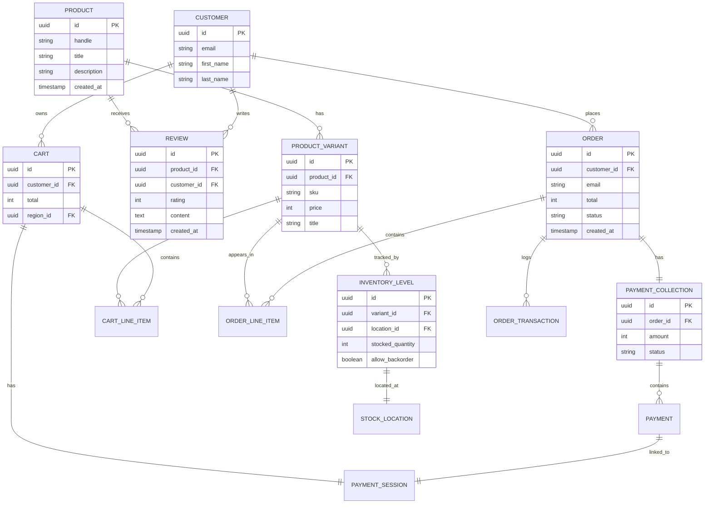

# Data Models

## Overview
Grace's Towel uses a PostgreSQL database. The schema is primarily managed by Medusa's core modules, with custom extensions for reviews and inventory.

## Entity Relationship Diagram



## Core Entities (Medusa)
The system relies on standard Medusa entities. Key tables include:

### Product Domain

| Entity | Purpose | Key Fields |
|--------|---------|------------|
| `product` | Base product information | id, handle, title, description |
| `product_variant` | SKUs, prices, options | id, product_id, sku, price |
| `product_option` | Size, color, etc. | id, product_id, title |
| `product_collection` | Product groupings | id, title, handle |

### Order Domain

| Entity | Purpose | Key Fields |
|--------|---------|------------|
| `order` | Customer orders | id, customer_id, total, status |
| `order_line_item` | Order items | id, order_id, variant_id, quantity |
| `order_transaction` | Payment movements | id, order_id, amount, type |

### Cart Domain

| Entity | Purpose | Key Fields |
|--------|---------|------------|
| `cart` | Shopping carts | id, customer_id, total, region_id |
| `cart_line_item` | Cart items | id, cart_id, variant_id, quantity |

### Payment Domain

| Entity | Purpose | Key Fields |
|--------|---------|------------|
| `payment_collection` | Payment tracking | id, order_id, amount, status |
| `payment_session` | Provider sessions | id, provider_id, data |
| `payment` | Completed payments | id, amount, status |

### Customer Domain

| Entity | Purpose | Key Fields |
|--------|---------|------------|
| `customer` | User accounts | id, email, first_name, last_name |
| `region` | Market regions | id, name, currency_code |

### Inventory Domain

| Entity | Purpose | Key Fields |
|--------|---------|------------|
| `inventory_level` | Stock tracking | id, variant_id, location_id, stocked_quantity |
| `stock_location` | Warehouse locations | id, name, address |

## Custom Modules

### Review Module (`apps/backend/src/modules/review`)
Custom module for handling product reviews.

#### `Review` (`review.ts`)
Stores individual product reviews.
- **Fields**:
    - `id`: Primary Key.
    - `product_id`: Reference to the product.
    - `customer_id`: Reference to the customer (if logged in).
    - `rating`: Integer (1-5).
    - `content`: Text body of the review.
    - `created_at`: Timestamp.

#### `ReviewHelpfulVote` (`review-helpful-vote.ts`)
Tracks helpfulness votes on reviews.
- **Fields**:
    - `id`: Primary Key.
    - `review_id`: FK to `Review`.
    - `user_id`: ID of the voter (optional/anonymous).
    - `vote_type`: 'helpful' | 'unhelpful'.

### Inventory Extensions

#### `inventory_level` (Extended)
Added `allow_backorder` boolean field to support JIT replenishment:
- **Default**: `false`
- **When `true`**: Stock can go negative, triggering `inventory.backordered` event

## Migrations
Migrations are managed via Medusa's CLI:
```bash
npx medusa db:migrate
```
Custom module migrations are located in `apps/backend/src/modules/review/migrations`.

Custom migrations for inventory extensions are in `apps/backend/src/migrations/`.

---

## See Also

- [Architecture Overview](./overview.md) - High-level system design
- [Backend Architecture](./backend.md) - API and workflow patterns
- [Data Layer](./data-layer.md) - Product data and caching strategies
- [Backend API Reference](../reference/backend-api.md) - API endpoints
