# Integrations & Data Flow

## Overview

Grace's Towel integrates with external services for payments, commerce, and infrastructure. This document details each integration and how data flows through the system.

## Integration Architecture

```mermaid
flowchart TB
    subgraph "Frontend Layer"
        SF["📱 Storefront"]
    end

    subgraph "Payment Services"
        Stripe["💳 Stripe"]
    end

    subgraph "Communication"
        Resend["📧 Resend"]
    end

    subgraph "Analytics"
        PostHog["📊 PostHog"]
    end

    subgraph "Infrastructure"
        CF["☁️ Cloudflare"]
        R2["📦 R2 Storage"]
    end

    subgraph "Backend Services"
        BE["🖥️ Medusa Backend"]
    end

    subgraph "Database Layer"
        Railway["🚂 Railway"]
        PG[("PostgreSQL")]
        Redis[("Redis")]
    end

    SF --> Stripe
    SF --> PostHog
    SF --> BE
    SF --> R2
    BE --> Stripe
    BE --> Resend
    BE --> PG
    BE --> Redis
    Railway --> PG
    Railway --> Redis
```



---

## Stripe Integration

### Overview

Stripe handles all payment processing, including:
- Payment Intents (card, ACH, Apple Pay, Google Pay)
- Shipping rate management
- Checkout sessions

### Payment Flow


### Configuration

**Environment Variables**:
```bash
STRIPE_SECRET_KEY=sk_live_...   # Server-side API key
STRIPE_PUBLISHABLE_KEY=pk_live_...  # Client-side key (embedded in code)
STRIPE_WEBHOOK_SECRET=whsec_...  # Webhook signature verification
```

### API Endpoints

#### Payment Intent (`/api/payment-intent`)

Creates a Stripe PaymentIntent for checkout.

**Request**:
```json
{
  "amount": 75.00,
  "currency": "usd",
  "shipping": 8.99
}
```

**Response**:
```json
{
  "clientSecret": "pi_xxx_secret_xxx"
}
```

#### Shipping Rates (`/api/shipping-rates`)

Fetches available shipping options from Stripe.

**Free Shipping Logic**:
- Threshold: $99
- Applied to: Ground Shipping only
- Dynamically recalculates when cart changes

### Stripe Elements Used

| Element | Purpose |
|---------|---------|
| `PaymentElement` | Card, bank, and wallet payments |
| `AddressElement` | Shipping address collection |
| `LinkAuthenticationElement` | Email + Stripe Link |
| `ExpressCheckoutElement` | Apple Pay, Google Pay, PayPal |

### Error Handling


---

## Medusa Integration

### Overview

Medusa v2 provides the headless commerce backend:
- Product catalog management
- Order processing
- Customer management
- Inventory tracking

### API Communication

```typescript
// hooks/useMedusaProducts.ts
const MEDUSA_API_URL = process.env.MEDUSA_BACKEND_URL || "http://localhost:9000";

const response = await fetch(`${MEDUSA_API_URL}/store/products`, {
  headers: { "Content-Type": "application/json" },
  credentials: "include",
});
```

### Implementation Status

| Feature | Status |
|---------|--------|
| Products API | ✅ Ready |
| Admin Dashboard | ✅ Ready |
| Checkout via Medusa | ✅ Ready |
| Order Management | ✅ Ready |
| Customer Auth | ✅ Ready |

---

## Resend (Email) Integration

### Overview

Resend handles all transactional emails:
- Order confirmation
- Shipping updates
- Password reset
- Guest order access (magic links)

### Email Queue Architecture


### Configuration

```bash
RESEND_API_KEY=re_...
EMAIL_FROM_ADDRESS=orders@gracestowel.com
```

---

## Railway Integration

### Services

| Service | Purpose | Connection |
|---------|---------|------------|
| PostgreSQL | Primary database | Internal/External URL |
| Redis | Caching, sessions, BullMQ | Internal/External URL |
| Medusa Container | API server | HTTP |

### Connection Patterns

**Production (Internal Network)**:
```
Medusa Container → postgres.railway.internal:5432
                 → redis.railway.internal:6379
```

**Local Development (External Proxy)**:
```
Local Machine → shuttle.proxy.rlwy.net:48905 (PostgreSQL)
              → shortline.proxy.rlwy.net:34142 (Redis)
```

---

## Cloudflare Integration

### Cloudflare Workers

The storefront runs on Cloudflare's edge network:

```jsonc
// wrangler.jsonc
{
  "name": "gracestowelstorefront",
  "compatibility_date": "2025-04-04",
  "compatibility_flags": ["nodejs_compat"]
}
```

### R2 Storage

Used for static assets and product images:

```bash
R2_BUCKET_NAME=gracestowel-assets
R2_ACCOUNT_ID=...
R2_ACCESS_KEY_ID=...
R2_SECRET_ACCESS_KEY=...
```

## PostHog Integration

### Overview

PostHog provides analytics and event tracking:
- Page views
- User interactions
- Checkout funnel analytics
- A/B testing

### Configuration

```bash
VITE_POSTHOG_KEY=phc_...
VITE_POSTHOG_HOST=https://app.posthog.com
```

### Event Tracking

```typescript
// Track custom event
posthog.capture('product_added_to_cart', {
  product_id: 'prod_123',
  product_name: 'Turkish Bath Towel',
  quantity: 2,
  price: 45.00
});
```

---

## Complete Checkout Flow


---

## See Also

- [Architecture Overview](./overview.md) - High-level system design
- [Backend Architecture](./backend.md) - Medusa patterns
- [Storefront Architecture](./storefront.md) - Frontend patterns
- [Environment Registry](../reference/env-registry.md) - All environment variables
- [Stripe Troubleshooting](../troubleshooting/stripe-errors.md) - Common Stripe issues
