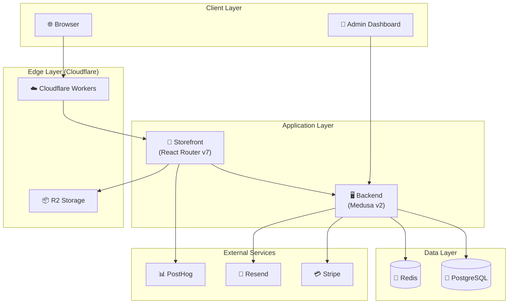
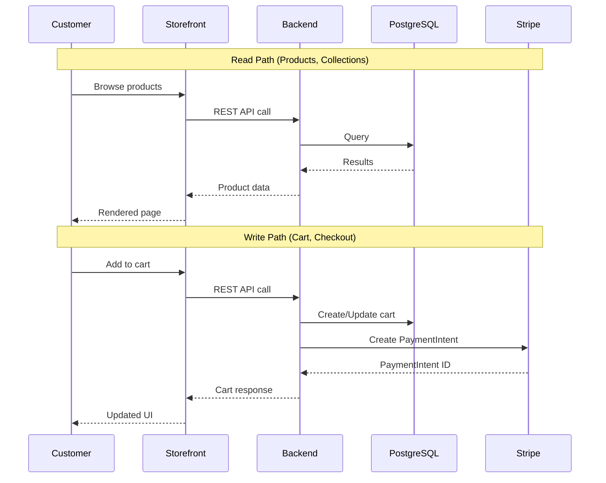

# Architecture Overview

## Executive Summary
Grace's Towel is a modern e-commerce platform built as a monorepo. It separates concerns between a highly dynamic, React-based storefront and a robust, module-based backend engine powered by Medusa v2.

## System Architecture Diagram

## Data Flow Overview

## High-Level Components
- **Storefront (`apps/storefront`)**: A React Router v7 application served via Vite. It handles all user interactions, product browsing, and checkout flows. It communicates with the backend via the Medusa JS SDK and custom API proxy routes.
- **Backend (`apps/backend`)**: A Medusa v2 Node.js application. It manages products, orders, customers, and business logic. It exposes REST APIs for the storefront and admin dashboard.

### Infrastructure & Services
- **Database**: PostgreSQL (managed via Railway or similar).
- **Cache**: Redis (for session management and event bus).
- **Search**: (To be configured/verified - likely Meilisearch or similar if enabled).
- **Storage**: Cloudflare R2 (S3-compatible) for product images and assets.
- **Email**: Resend for transactional emails (order confirmation, etc.).
- **Analytics**: PostHog for user tracking and event analytics.

## Tech Stack Summary

| Component | Technology | Version | Purpose |
| :--- | :--- | :--- | :--- |
| **Storefront** | React | v19 | UI Library |
| | React Router | v7 | Routing & Framework |
| | Vite | v5+ | Build Tool |
| | Tailwind CSS | v4 | Styling |
| | Medusa JS SDK | v2 | Backend Communication |
| **Backend** | Node.js | >=24 | Runtime |
| | Medusa | v2.12 | E-commerce Framework |
| | PostgreSQL | - | Primary Database |
| | Redis | - | Caching, Events & Locking |
| | BullMQ | - | Job Queue (Email, etc.) |
| **Integrations**| Stripe | - | Payments |
| | Resend | - | Email Notifications |
| | PostHog | - | Analytics |

## Key Architectural Patterns

### Workflow-Level Locking
Critical workflows use Medusa's `acquireLockStep`/`releaseLockStep` to prevent race conditions:
- Order creation from Stripe webhooks (lock key: PaymentIntent ID)
- Prevents duplicate orders from concurrent webhook deliveries

### Atomic Inventory Management
- `InventoryDecrementService` handles all inventory operations
- Uses `updateInventoryLevelsStep` for atomic updates with automatic rollback
- Supports backorders via `allow_backorder` flag on `inventory_level`
- Strict location mapping (no arbitrary fallbacks)

### Payment Module Integration
- All orders have linked `PaymentCollection` records (required, no fallback)
- `Order.total` is source of truth, synced to PaymentCollection and Stripe
- `OrderTransaction` records created for all financial movements
- Currency conversion handled by Medusa's Stripe provider (major ↔ minor units)

---

## See Also

- [Backend Architecture](./backend.md) - Medusa modules, API structure, payment processing
- [Storefront Architecture](./storefront.md) - React Router patterns, state management
- [Data Models](./data-models.md) - Database schema and entities
- [Integrations](./integrations.md) - External service integration details
- [Development Guide](../guides/development.md) - Local setup instructions
