# Storefront Architecture

## Overview
The storefront is a **React Router v7** application located in `apps/storefront`. It is designed to be performant, SEO-friendly, and responsive. It runs on **Cloudflare Workers** at the edge for optimal performance.

## Architecture Diagram

```mermaid
flowchart TB
    subgraph "Client Browser"
        UI["React UI Components"]
        Stripe["Stripe Elements"]
        PostHog["PostHog SDK"]
    end

    subgraph "Cloudflare Workers (Edge)"
        SF["Storefront App"]
        Loader["Route Loaders"]
        Actions["Route Actions"]
        API["API Routes"]
    end

    subgraph "Data Sources"
        BE["🖥️ Backend API<br/>(Reads & Writes)"]
    end

    UI --> Loader
    UI --> Actions
    UI --> API
    Stripe --> API
    PostHog --> PostHog["PostHog Cloud"]
    Loader --> BE
    Actions --> BE
    API --> BE
    BE --> PG[("PostgreSQL")]
```



## Data Access Pattern


**Key Principle**: Reads and writes go through the Medusa API to ensure business logic execution.

## Core Capabilities

### Routing & Pages
The application uses file-system based routing:
- **Product Experience**:
    - `/products/$handle`: Product Detail Page (PDP).
    - `/collections/$handle`: Collection/Category pages.
    - `/search`: Search results page.
    - `/towels`: Specialized landing/category page.
- **Checkout Flow**:
    - `/cart`: Shopping cart view.
    - `/checkout`: Main checkout process.
    - `/checkout/success`: Order confirmation.
    - `/order/status/$id`: Guest order status page.
- **User Account**:
    - `/account`: Dashboard.
    - `/account/login`: Authentication.
    - `/account/register`: Registration.
- **Content**:
    - `/blog`, `/blog/$id`: Blog section.
    - `/about`: About page.
    - `/wishlist`: User wishlist.

### Route Structure

```
apps/storefront/app/routes/
├── home.tsx                        # Landing page
├── products.$handle.tsx            # Product detail page
├── collections.$handle.tsx         # Collection pages
├── cart.tsx                        # Shopping cart
├── checkout.tsx                    # Checkout flow
├── checkout.success.tsx            # Order confirmation
├── order_.status.$id.tsx           # Guest order status
├── account.tsx                     # Account dashboard
├── account.login.tsx               # Login page
├── account.register.tsx            # Registration
├── api.carts.$id.ts               # Cart API
├── api.carts.$id.shipping-options.ts  # Shipping options
├── api.payment-intent.ts           # Payment intent API
├── api.checkout-session.ts         # Checkout session API
└── api.health.ts                   # Health check
```

### API Proxying & BFF Pattern
The storefront includes server-side resource routes (loaders/actions) that act as a Backend-for-Frontend (BFF) to securely interact with third-party services or abstract complex backend calls:
- `api.checkout-session.ts`: Manages Stripe checkout sessions.
- `api.payment-intent.ts`: Manages Stripe PaymentIntent lifecycle (create OR update).
  - **Security**: Ignores client-provided `amount`. Fetches canonical `medusa_cart_id` to calculate totals server-side.
  - **Pattern**: "Create once, update on changes" with server-side attributes.
  - **Idempotency**: Generates keys based on `hash(cartId + cart.total)` to prevent duplicates.
- `api.shipping-rates.ts`: Fetches shipping options.
- `api.health.ts`: Health check endpoint.

### Logging & Observability
- **Structured Logging**: `lib/logger.ts` provides JSON-structured logging with trace IDs
- **Trace Propagation**: `x-trace-id` header passed from frontend to backend
- **Error References**: Error responses include `traceId` for support escalation

### State Management & Styling
- **State**: React Server Components / Loaders are used for data fetching. Local state is managed via React hooks.
- **Styling**: Tailwind CSS v4 is used for all styling requirements.

### Integrations
- **Medusa SDK**: Used for cart management, product retrieval, and customer auth.
- **PostHog**: Integrated via `utils/posthog.ts` for client-side event tracking.
- **Stripe**: Integrated via `@stripe/react-stripe-js` for payment element rendering.

## Edge Runtime Constraints

Since the storefront runs on Cloudflare Workers:

| ❌ Not Available | ✅ Available |
|-----------------|-------------|
| Node.js `fs`, `path`, `child_process` | Web APIs (fetch, crypto, etc.) |
| Direct database drivers | Not allowed |
| Node.js-specific libraries | Web-compatible libraries |
| Long-running processes | Edge-optimized functions |

**Important**: Do not use direct database drivers from the storefront.

---

## See Also

- [Architecture Overview](./overview.md) - High-level system design
- [Backend Architecture](./backend.md) - Medusa backend patterns
- [Storefront API Reference](../reference/storefront-api.md) - API route documentation
- [Storefront Components](../reference/storefront-components.md) - React component library
- [Development Guide](../guides/development.md) - Local setup instructions
