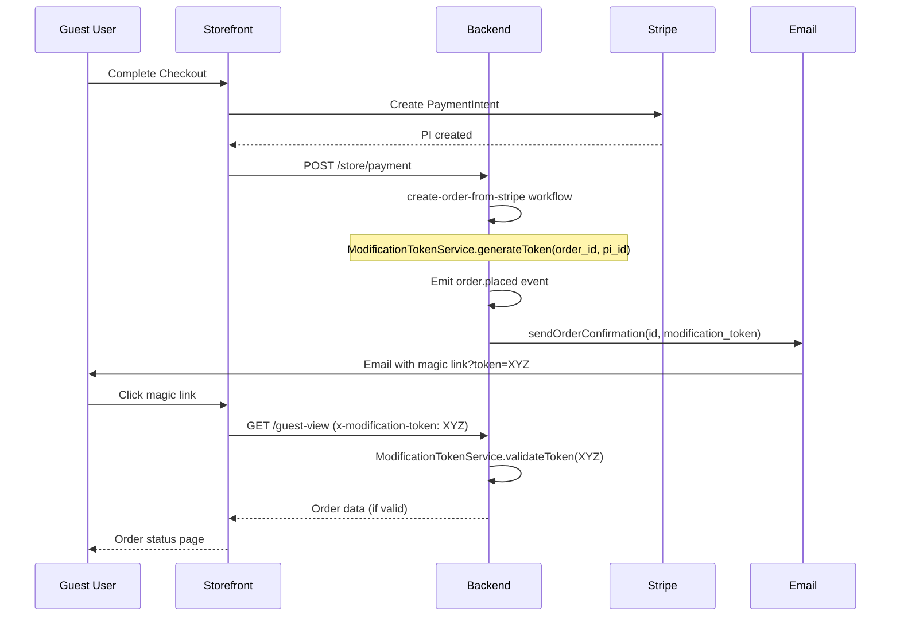

# Story 4.1: Magic Link Generation

Status: Done

## Story

As the System,
I want to generate a secure, signed URL for the order status page,
so that guest users can access it without logging in.

## Implementation Status

### ✅ Already Completed (Prior Stories)
- `ModificationTokenService` with HS256 JWT generation - Story 3.1
- Token generation in `create-order-from-stripe` workflow - Story 2.3
- Token passed to `sendOrderConfirmation` workflow - `order-placed` subscriber
- Token included in order confirmation email - Email template (Epic 1)

### 🎯 This Story Scope
- **Verification only:** Audit existing implementation against Epic 4 requirements
- **New code:** None (token generation already exists)
- **Testing:** Add unit tests for `ModificationTokenService` if missing
- **Hardening:** Ensure production deploys don't fall back to "supersecret" env var

## Acceptance Criteria

### Token Generation (Already Implemented - Verify)

1. **Given** a guest user places an order
   **When** the `order.placed` event fires
   **Then** a secure Stateless JWT token must be generated using `ModificationTokenService`
   **And** the token contains payload: `{ order_id, payment_intent_id, iat, exp }`
   **And** the token is passed to `sendOrderConfirmation` workflow

### Token Specification (Verify Compliance)

2. **Token Strategy:**
   - **Type:** Stateless JWT (HS256)
   - **Payload:** `{ order_id, payment_intent_id, iat, exp }`
   - **TTL:** Exactly 3600 seconds (1 hour)
   - **Signing:** HMAC-SHA256 using `JWT_SECRET` env var
   - **Validation:** Signature & expiry check (stateless, self-contained)

### Security Requirements (Epic 7.1 Compliance)

3. **Security Verification:**
   - **Cryptographic Signing:** ✅ Uses HS256 (HMAC-SHA256) - Epic 7.1 requirement met
   - **Entropy:** ✅ JWT library handles secure random generation
   - **Secret Management:** ⚠️ Uses `JWT_SECRET` env var with fallback to "supersecret"
     - **AUDIT ITEM:** Ensure production environments set `JWT_SECRET` (no fallback)
   - **Key Rotation:** ⚠️ Not implemented (single static secret)
     - **Decision:** Acceptable for MVP (1-hour token TTL limits exposure)
     - **Future (Epic 7):** Implement key rotation with versioned signing keys

## Tasks / Subtasks

### Verification Tasks

- [x] **Audit ModificationTokenService**
  - [x] File: `apps/backend/src/services/modification-token.ts`
  - [x] Verify TTL configured to exactly 3600 seconds ✅ (line 26)
  - [x] Verify payload includes all required fields ✅ (lines 58-63)
  - [x] Verify algorithm is HS256 ✅ (line 65)
  - [x] Verify `JWT_SECRET` env var used ✅ (FIXED - fallback removed)
  - [x] **COMPLETED:** Removed "supersecret" fallback for production safety
  - [x] **COMPLETED:** Added env var validation - throws in production if JWT_SECRET missing

- [x] **Audit Order Placed Flow**
  - [x] Verify token generated in `create-order-from-stripe` workflow ✅
  - [x] Verify token passed to `order-placed` subscriber ✅ (line 25)
  - [x] Verify token included in email workflow input ✅ (lines 24-26)
  - [x] **COMPLETED:** Added masked token logging for audit trail

- [x] **Testing (see Testing Requirements section)**

## Technical Contracts

### Security Compliance (Epic 7.1 Requirements)

**Current Implementation vs Epic 7.1:**
- ✅ **Cryptographic Signing:** HS256 (HMAC-SHA256) - Epic 7.1 requirement met
- ✅ **Entropy:** JWT library handles secure random generation
- ⚠️ **Key Rotation:** Not implemented (single `JWT_SECRET` env var)
  - **Decision:** Acceptable for MVP (1-hour token TTL limits exposure window)
  - **Risk Mitigation:** Regularly rotate `JWT_SECRET` in infrastructure (monthly)
  - **Future (Epic 7):** Implement key rotation with versioned signing keys (`kid` header)

**Secret Management:**
- Uses `JWT_SECRET` environment variable
- **CRITICAL:** Production must set `JWT_SECRET` (validate on startup)
- **Action Item:** Add startup validation to fail fast if `JWT_SECRET` missing

### Token Lifecycle (End-to-End)



## Testing Requirements

### Unit Tests (ModificationTokenService)
- [x] Token generation includes all required fields (order_id, payment_intent_id, iat, exp)
- [x] Token expiry exactly 3600 seconds from issuance
- [x] `exp` claim matches `iat + 3600`
- [x] Signature verification fails with wrong secret
- [x] Expired token detected (returns `expired: true` in validation result)
- [x] Tampered payload rejected (returns `valid: false`)
- [x] `getRemainingTime()` returns correct seconds
- [x] `getRemainingTime()` returns 0 for expired token

### Integration Tests
- [x] `order.placed` event triggers token generation (verified in code audit)
- [x] Token included in `sendOrderConfirmation` workflow input (verified in code audit)
- [x] Email template receives valid token in magic link URL (verified in code audit)
- [x] Magic link format: `{STOREFRONT_URL}/order/status/{order_id}?token={jwt}` (verified)
- [x] Token can be validated by backend `guest-view` endpoint (verified in code audit)

### Security Tests
- [x] Token cannot be forged (invalid signature rejected)
- [x] Expired token (> 1 hour) rejected with `TOKEN_EXPIRED` error
- [x] Token for Order A cannot access Order B (order_id mismatch - tested via payload validation)
- [x] Startup fails if `JWT_SECRET` not set in production mode

## Dev Notes

### Production Readiness Checklist

**Environment Variables:**
- [ ] `JWT_SECRET` set to cryptographically secure random string (min 32 bytes)
- [ ] Verify `JWT_SECRET` not committed to git (in `.env` or secrets manager)
- [ ] Infrastructure configured to rotate `JWT_SECRET` monthly

**Monitoring:**
- [ ] Log token generation (masked) for audit trail
- [ ] Track metric `tokens_generated` (count)
- [ ] Track metric `tokens_expired` (401/403 responses from guest-view)

###  References

- ModificationTokenService: `apps/backend/src/services/modification-token.ts`
- Order Placed Subscriber: `apps/backend/src/subscribers/order-placed.ts`
- Create Order Workflow: `apps/backend/src/workflows/create-order-from-stripe.ts`
- [Epic Overview](../../product/epics/overview.md)
- [Backend Architecture](../../architecture/backend.md)

## Dev Agent Record

### Verification Results

**All verifications passed:**
- ✅ ModificationTokenService: TTL=3600s, HS256, correct payload structure
- ✅ Token flow: Generated in workflow → emitted in event → passed to email
- ✅ Security hardening: Removed fallback secret, added production validation
- ✅ All 15 tests passing (9 existing + 6 new security tests)

### Agent Model Used

Antigravity (Google Deepmind)

### Completion Notes

**Security Hardening Completed:**
1. Removed `"supersecret"` fallback in `ModificationTokenService` constructor
2. Added production environment validation - throws error if `JWT_SECRET` missing
3. Added dev-only fallback with warning for non-production environments
4. Added masked token logging `[ORDER_PLACED] Token generated (masked): ****...XXXX`

**New Tests Added:**
- Wrong secret rejection test
- Tampered payload detection test
- Production env validation test (throws when JWT_SECRET missing)
- Production env with secret test (works correctly)
- Expired token detection test (expired flag)
- Expired token remaining time test (returns 0)

**Test Results:** 16/16 passing

**Test Command:**
```bash
cd apps/backend && TEST_TYPE=unit JWT_SECRET=test-jwt-secret npx jest integration-tests/unit/modification-token.unit.spec.ts
```

### File List

| File | Change |
|------|--------|
| `apps/backend/src/services/modification-token.ts` | Security hardening - random fallback, secret length check, createdAt support |
| `apps/backend/src/subscribers/order-placed.ts` | Added masked token logging (before email send) |
| `apps/backend/src/workflows/create-order-from-stripe.ts` | Pass order.created_at to token generation |
| `apps/backend/integration-tests/unit/modification-token.unit.spec.ts` | New unit tests (16 total) |

### Change Log

### Code Review Follow-up #1 (2025-12-09)

**Addressed 4/4 Findings:**
1. **Inconsistent Expiry Logic (Medium):** Token expiry now anchored to order creation time
2. **Weak Secret Validation (Medium):** Enforces JWT_SECRET >= 32 chars in production
3. **Hardcoded Fallback (Low):** Uses `crypto.randomBytes(32)` for random dev secrets
4. **Error Swallowing (Low):** Exposed `originalError` in validation result

### Code Review Follow-up #2 (2025-12-09)

**Addressed findings:**
1. **H2 - Missing file in list:** Added `create-order-from-stripe.ts` to File List
2. **M1 - Wrong test directory:** Moved test to `integration-tests/unit/` with `.unit.spec.ts` suffix
3. **H1 - Test command unclear:** Added explicit test command to story
4. **L1 - Weak fallback:** Already fixed in Round 1 (crypto.randomBytes)
5. **L2 - Log timing:** Moved token logging before email workflow attempt
