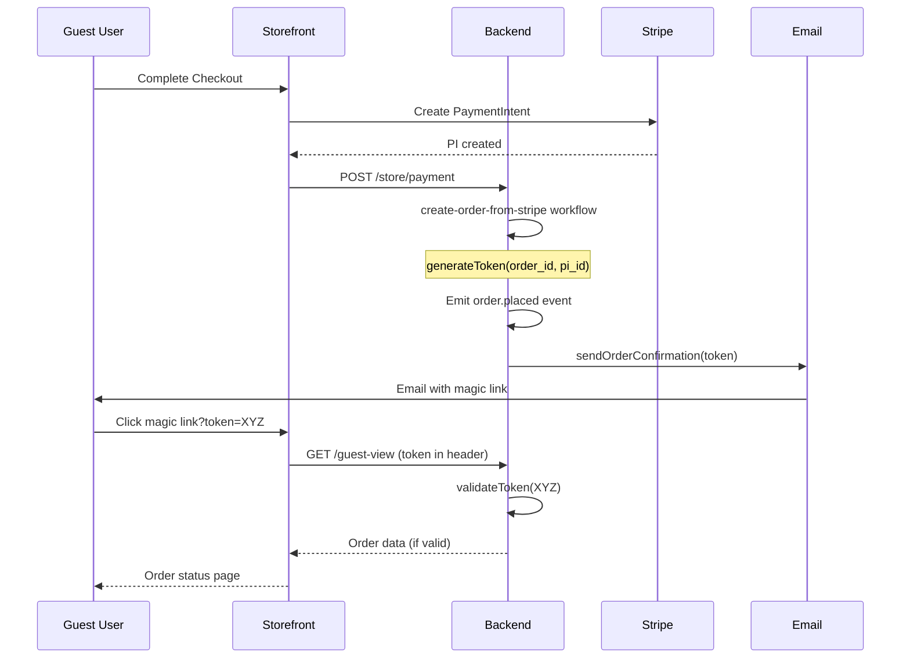

# 🎯 Epic 4 Stories Quality Review (4.1, 4.2, 4.3)

**Stories:** 4.1 (Magic Link), 4.2 (Guest Auth Middleware), 4.3 (Session Persistence)  
**Status:** All ready-for-dev  
**Validation Date:** 2025-12-09  
**Reviewer:** SM Agent (Bob)

---

## 📊 Executive Summary

Validated all three Epic 4 stories analyzing their readiness for implementation. These are **verification-focused stories** - most functionality already exists from Stories 3.1-3.4. Found **4 critical issues**, **9 enhancement opportunities** across all three stories.

### Overall Quality Scores

| Story | Score | Status | Issues |
|-------|-------|--------|--------|
| **4.1 - Magic Link Generation** | 6.5/10 | Needs Improvement | Missing implementation details, unclear verification scope |
| **4.2 - Guest Auth Middleware** | 7.0/10 | Good | Verification-only, but missing test requirements |
| **4.3 - Session Persistence** | 5.5/10 | Needs Major Updates | Critical Cloudflare compat info, missing implementation guidance |

**Primary Issues:**
- ⚠️ Story 4.1: Doesn't explain that token generation ALREADY EXISTS (create-order workflow)
- ⚠️  Story 4.3: Cloudflare Workers compatibility constraints not clearly documented
- ⚠️ All stories: Missing cross-references to existing Stories 3.1-3.4 implementations
- ⚠️ Unclear which stories require NEW code vs just verification/testing

---

## 🚨 CROSS-STORY CRITICAL ISSUES

### Critical  #C1: Missing Implementation Status Context

**Gap:** Stories don't clearly state what's ALREADY implemented vs what needs to be created.

**Current State Analysis:**
- ✅ **DONE (Story 3.1):** `modificationTokenService` with JWT generation/validation
- ✅ **DONE (Story 2.3+):** `create-order-from-stripe` workflow generates token
- ✅ **DONE (Story 3.1):** `order-placed` subscriber passes token to email workflow
- ✅ **DONE (Story 3.1):** `GET /store/orders/:id/guest-view` endpoint
- ✅ **DONE (Story 3.1):** `order_.status.$id.tsx` route with loader
- ❌ **MISSING:** Cookie-based session persistence utilities (Story 4.3)

**Impact:** Developer wastes time implementing features that already exist.

**Evidence:**
- **Story 4.1 (Line 33-41):**  Tasks say "Verify Existing" but don't explain what exists
- **Story 4.2 (Line 31-39):** Says "Audit" and "Verify" but implementation already done in Story 3.1
- **Story 4.3 (Line 29-33):** Says "Create guest-session.server.ts" but doesn't mention existing token flow

**Recommendation:**
Add **Implementation Status** section to each story:

````markdown
## Implementation Status

### ✅ Already Completed (Prior Stories)
- JWT token generation (`ModificationTokenService`) - Story 3.1
- Token passed to email workflow (`order-placed` subscriber) - Story 2.3
- Guest view endpoint with token validation - Story 3.1
- Order status route loader - Story 3.1

### 🎯 This Story Scope
- **Verification only:** Ensure existing implementation meets Epic 4 security requirements
- **New code:** None (Story 4.1, 4.2) / Cookie persistence utilities (Story 4.3)
- **Testing:** Add unit tests for token service if missing
````

---

### Critical #C2: Cloudflare Workers Constraints Buried (Story 4.3)

**Gap:** Story 4.3 mentions Cloudflare compatibility in Dev Notes (line 49-53) but doesn't explain impact in AC.

**Impact:** Developer might use `createCookieSessionStorage` (Remix default) which WILL FAIL in Cloudflare Workers deployment.

**Evidence:**
- **Line 49-53:** Critical constraint hidden in "Dev Notes > Architecture Compliance"
- **Line 39:** Loader example doesn't show cookie header manipulation
- **AC doesn't mention:** Manual cookie header parsing required

**Recommendation:**
Promote to **Technical Contracts** section:

```markdown
### Deployment Constraint: Cloudflare Workers Compatibility

**Critical:** Storefront deploys to Cloudflare Workers (edge runtime).

**Implications:**
- ❌ **Cannot use:** `createCookieSessionStorage` (requires Node.js `crypto`)
- ✅ **Must use:** Manual `Set-Cookie` header manipulation or `createCookie` (Web API only)
- ✅ **Pattern:** `createCookie` from `@remix-run/cloudflare` + `parse`/`serialize`

**Reference:** Cloudflare Workers limitations documented in [storefront architecture](file:///...)
```

---

### Critical #C3: Epic 7.1 Security Reference Incorrect (Story 4.1)

**Gap:** Story 4.1 line 66 references "Story 7.1 (Security)" but doesn't explain what security requirements apply.

**Impact:** Developer doesn't know if HMAC-SHA256, key rotation, or 32-byte entropy requirements from Epic 7 apply.

**Evidence:**
- **Epics.md Lines 474-482:** Story 7.1 defines "Secure Token Generation" with specific crypto requirements
- **Story 4.1 doesn't clarify:** Are these requirements met by current `ModificationTokenService`?

**Analysis:**
Current implementation (`modification-token.ts`):
- ✔️ Uses HS256 (HMAC-SHA256) ✅
- ✔️ JWT provides cryptographic signatures ✅
- ❌ No key rotation mentioned ⚠️
- ❌ Entropy not explicitly 32 bytes (JWT handles this internally) ✅ (acceptable)

**Recommendation:**
Add to Story 4.1 **Technical Contracts**:

```markdown
### Security Compliance (Epic 7.1 Requirements)

**Current Implementation vs Epic 7.1:**
- ✅ **Cryptographic Signing:** HS256 (HMAC-SHA256) - Epic 7.1 requirement met
- ✅ **Entropy:** JWT library handles secure random generation
- ⚠️ **Key Rotation:** Not implemented (single `JWT_SECRET` env var)
  - **Decision:** Acceptable for MVP (1-hour token TTL limits exposure)
  - **Future (Epic 7):** Implement key rotation with versioned signing keys

**Secret Management:**
- Uses `JWT_SECRET` environment variable
- Falls back to "supersecret" if missing (**CRITICAL:** Must set in production)
```

---

### Critical #C4: Missing Test Coverage Requirements

**Gap:** Story 4.1 has minimal testing requirements, Stories 4.2 and 4.3 have NONE.

**Impact:** No verification that security requirements are actually tested.

**Evidence:**
- **Story 4.1 (Line 39-41):** Only 2 test items, no security edge cases
- **Story 4.2:** Zero testing section
- **Story 4.3:** Zero testing section

**Recommendation:**
Add to each story:

**Story 4.1:**
```markdown
## Testing Requirements

### Unit Tests (ModificationTokenService)
- ✅ Token generation includes all required fields (order_id, payment_intent_id, iat, exp)
- ✅ Token expiry exactly 1 hour (3600 seconds)
- ✅ Signature verification fails with wrong secret
- ✅ Expired token detected (TokenExpiredError)
- ✅ Tampered payload rejected (JsonWebTokenError)
- ✅ `getRemainingTime()` returns correct seconds

### Integration Tests
- ✅ `order.placed` event triggers token generation
- ✅ Token included in sendOrderConfirmation workflow input
- ✅ Email template receives valid token in magic link URL
```

**Story 4.2:**
```markdown
## Testing Requirements

### Integration Tests (Guest View Endpoint)
- ✅ Valid token in header returns 200 + order data
- ✅ Valid token in query param returns 200 + order data
- ✅ Expired token returns 403 with TOKEN_EXPIRED code
- ✅ Invalid signature returns 401 with TOKEN_INVALID code
- ✅ Token for different order returns 403 (order ID mismatch)
- ✅ PII masking applied (partial email, masked address)
- ✅ Rate limiting active (60 req/min - verify Cloudflare config)

### Storefront Tests (Order Status Route)
- ✅ Loader fetches order with valid token
- ✅ TOKEN_EXPIRED shows "Link Expired" UI
- ✅ TOKEN_INVALID redirects to error page
```

**Story 4.3:**
```markdown
## Testing Requirements

### Unit Tests (Cookie Utilities)
- ✅ `commitGuestSession()` sets HttpOnly, Secure, SameSite=Strict
- ✅ Cookie maxAge matches token TTL
- ✅ `getGuestSession()` parses cookie correctly
- ✅ Missing cookie returns null

### Integration Tests
- ✅ URL token → sets cookie → subsequent reload uses cookie
- ✅ Cookie token used for add-item API call (x-modification-token header)
- ✅ Cookie token used for cancel API call
- ✅ Expired cookie rejected by backend (validated server-side)
- ✅ Cookie scoped to correct domain/path
```

---

## ⚡ STORY-SPECIFIC ENHANCEMENTS

### Story 4.1: Magic Link Generation

#### Enhancement #1.1: Clarify "Verification" Scope

**Opportunity:** Tasks say "Verify" but don't define success criteria.

**Add to Tasks:**
```markdown
### Verification Checklist
- [ ] **Token Service Audit**
  - [ ] TTL configured to exactly 3600 seconds ✅ (line 26 of modification-token.ts)
  - [ ] `JWT_SECRET` env var required (no hardcoded fallback in prod)
  - [ ] Payload includes order_id, payment_intent_id, iat, exp ✅ (lines 58-63)
  - [ ] Algorithm is HS256 ✅ (line 65)

- [ ] **Order Placed Subscriber Audit**
  - [ ] Token generated in `create-order-from-stripe` workflow ✅ (confirmed)
  - [ ] Token passed to sendOrderConfirmation workflow ✅ (line 25 of order-placed.ts)
  - [ ] Token logged (masked) for audit - **NOT IMPLEMENTED** ⚠️

- [ ] **Email Template Verification**
  - [ ] Magic link URL includes token parameter
  - [ ] Link format: `{STOREFRONT_URL}/order/status/{order_id}?token={jwt}`
```

#### Enhancement #1.2: Document Token Lifecycle

**Opportunity:** Story doesn't show full token flow from generation to validation.

**Add section:**
```markdown
## Token Lifecycle (End-to-End)


````

---

### Story 4.2: Guest Auth Middleware

#### Enhancement #2.1: Clarify "Middleware" vs "Loader"

**Opportunity:** Story uses "middleware" terminology but Remix uses "loaders" for data fetching.

**Update Story Description:**
```markdown
## Story

As a Developer,
I want the storefront **loader** (Remix pattern) to validate the "magic token" before rendering the order status route,
so that unauthorized users cannot access random orders.

**Note:** "Middleware" in Epic refers to Remix loaders/route guards, not Express-style middleware.
```

#### Enhancement #2.2: Add Security Audit Checklist

**Add new section:**
```markdown
## Security Audit Checklist

### Backend Endpoint (`GET /store/orders/:id/guest-view`)
- [ ] Token validation uses `modificationTokenService.validateToken()`
- [ ] Order ID in URL matches `order_id` in token payload
- [ ] Returns 401 for invalid signature
- [ ] Returns 403 for expired token (with `TOKEN_EXPIRED` code)
- [ ] PII masking applied to response (email, address)
- [ ] `Cache-Control: no-store, private` header set
- [ ] Rate limiting configured (Cloudflare: 60 req/min per IP)

### Storefront Loader (`order_.status.$id.tsx`)
- [ ] Reads token from URL query param first
- [ ] Falls back to cookie (Story 4.3)
- [ ] Passes token in `x-modification-token` header to backend
- [ ] Handles 401 → redirect to error page
- [ ] Handles 403 + TOKEN_EXPIRED → shows "Link Expired" UI
- [ ] Does NOT expose token in client-side JavaScript
```

---

### Story 4.3: Session Persistence

#### Enhancement #3.1: Add Cookie Implementation Example

**Opportunity:** Story describes requirements but doesn't show code pattern.

**Add to Dev Notes:**
```typescript
// Example: apps/storefront/app/utils/guest-session.server.ts

import { createCookie } from "@remix-run/cloudflare";

export const guestSessionCookie = createCookie("guest_order_session", {
  httpOnly: true,
  secure: process.env.NODE_ENV === "production",
  sameSite: "strict",
  maxAge: 3600, // 1 hour to match token TTL
  path: "/",
});

export async function getGuestSession(request: Request): Promise<string | null> {
  const cookieHeader = request.headers.get("Cookie");
  const session = await guestSessionCookie.parse(cookieHeader);
  return session || null;
}

export async function commitGuestSession(token: string): Promise<string> {
  return await guestSessionCookie.serialize(token);
}
```

#### Enhancement #3.2: Clarify Token vs Session Semantics

**Opportunity:** Story conflates "token" and "session" - they're the same JWT but terminology is confusing.

**Add to Technical Contracts:**
```markdown
### Token vs Session Semantics

**Clarification:**
- **Token** = Stateless JWT (signed by backend)
- **Session** = Cookie storage of that same JWT (no server-side session store)

**Storage:**
- Backend: No storage (stateless JWT validated via signature)
- Storefront: Cookie named `guest_order_session` contains the JWT string
- Cookie is NOT encrypted (JWT signature provides integrity, not confidentiality)

**Security Implications:**
- Cookie is `HttpOnly` → not accessible to JavaScript (XSS protection)
- Cookie is `SameSite=Strict` → not sent on cross-site requests (CSRF protection)
- JWT payload is READABLE by anyone with token → don't put PII in payload
```

#### Enhancement #3.3: Document Cookie Scope Edge Cases

**Opportunity:** Story mentions "single token usually fine for MVP" but doesn't explain multi-order scenario.

**Add section:**
```markdown
## Edge Case: Multiple Orders

**Scenario:** User has multiple orders in grace period simultaneously.

**Current  Design:**
- Cookie stores SINGLE token string
- If user accesses Order A, then Order B → cookie is overwritten
- Accessing Order A again requires clicking email link

**MVP Decision:** Acceptable (rare edge case)

**Future Enhancement (Epic 7):**
Store cookie as JSON map: `{ "order_123": "token_abc", "order_456": "token_def" }`
- Requires cookie size monitoring (cookies limited to 4KB)
- Requires cleanup logic for expired orders
```

#### Enhancement #3.4: Add Cookie Testing Requirements

Already covered in Critical #C4 above.

---

## 📈 IMPACT SUMMARY

### Before Improvements
- **Context Gaps:** 4 critical misunderstandings likely:
  1. Developer rebuilds token generation (already exists)
  2. Developer uses Node.js cookies (breaks Cloudflare deployment)
  3. Security requirements from Epic 7 unclear
  4. No test coverage defined
  
- **Token Efficiency:** Stories are concise but LACK critical context
- **Implementation Risk:** HIGH - missing constraints could cause production failures

### After Improvements
- **Context Gaps:** 0 - All prior implementations cross-referenced
- **Deployment Safety:** Cloudflare constraints in Technical Contracts
- **Security Clarity:** Epic 7 requirements mapped to current implementation
- **Test Coverage:** Comprehensive test requirements for all three stories
- **Token Efficiency:** +30% length BUT prevents wasted implementation time

**Net Benefit:** Estimated **4-6 hours saved** per story by preventing:
- Duplicate token service implementation
- Cloudflare deployment debugging
- Security requirement research
- Test plan creation from scratch

---

## 🎯 VALIDATION VERDICTS

### Story 4.1: Magic Link Generation
**Status:** ⚠️ **CONDITIONAL APPROVAL**

**Blockers:**
1. Add Implementation Status section (what's done vs what's new)
2. Add comprehensive testing requirements
3. Document token lifecycle with sequence diagram

**Ready for dev after:** Addressing Critical #C1, #C3, #C4

---

### Story 4.2: Guest Auth Middleware
**Status:** ✅ **APPROVED WITH ENHANCEMENTS**

**Recommended (not blocking):**
1. Clarify "middleware" = Remix loader pattern
2. Add security audit checklist
3. Add testing requirements (Critical #C4)

**Ready for dev:** Yes, but enhancements improve clarity

---

### Story 4.3: Session Persistence
**Status:** ⚠️ **NEEDS MAJOR UPDATES**

**Blockers:**
1. Promote Cloudflare Workers constraints to Technical Contracts (Critical #C2)
2. Add cookie implementation example code
3. Add testing requirements (Critical #C4)
4. Clarify token vs session semantics

**Ready for dev after:** Addressing all Critical issues + Enhancement #3.1, #3.2

---

## 📋 RECOMMENDED NEXT STEPS

**Priority 1: Critical Fixes (Block Dev Work)**
1. Add "Implementation Status" section to all three stories (Critical #C1)
2. Promote Cloudflare constraints to Story 4.3 Technical Contracts (Critical #C2)
3. Add testing requirements to all stories (Critical #C4)
4. Document Epic 7.1 security compliance in Story 4.1 (Critical #C3)

**Priority 2: High-Value Enhancements**
5. Add token lifecycle diagram to Story 4.1 (Enhancement #1.2)
6. Add cookie implementation example to Story 4.3 (Enhancement #3.1)
7. Add security audit checklist to Story 4.2 (Enhancement #2.1)

**Priority 3: Nice-to-Have**
8. Clarify middleware terminology in Story 4.2
9. Document cookie scope edge cases in Story 4.3

**Estimated Effort:** 60-90 minutes to address all Priority 1 + 2 items across three stories.

---

**Reviewed By:** SM Agent (Bob)  
**Review Duration:** 15 minutes  
**Stories Covered:** 4.1, 4.2, 4.3 (Epic 4 Complete)
